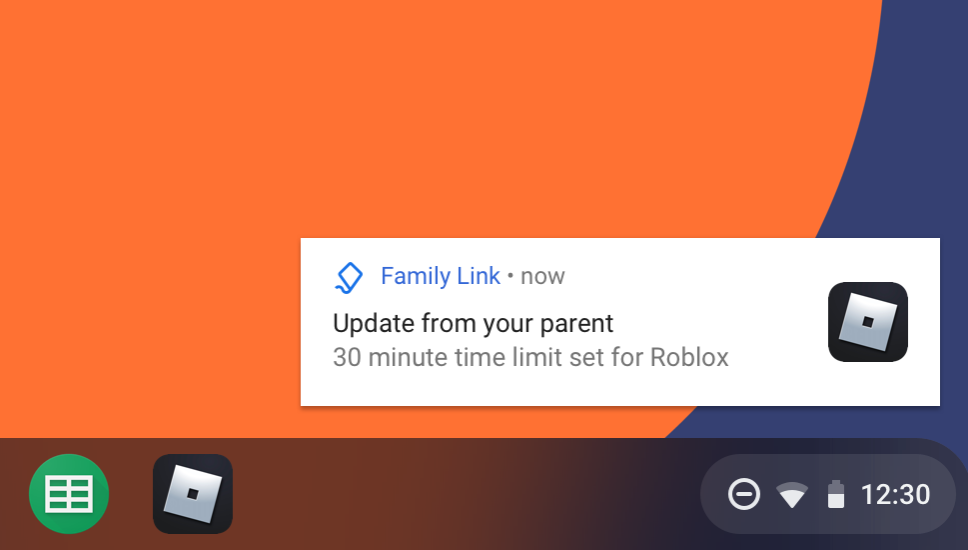
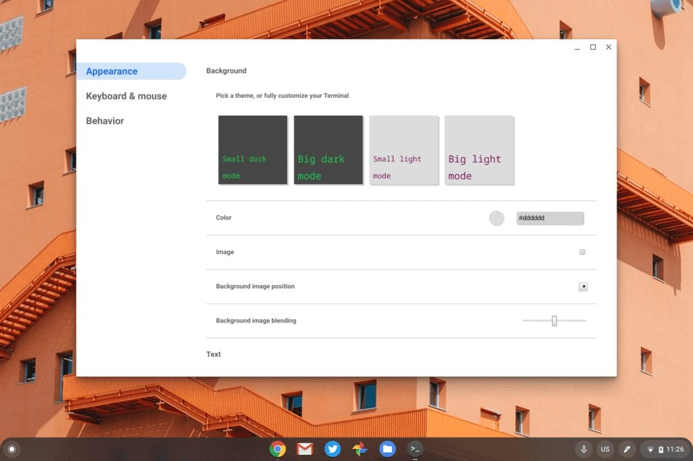
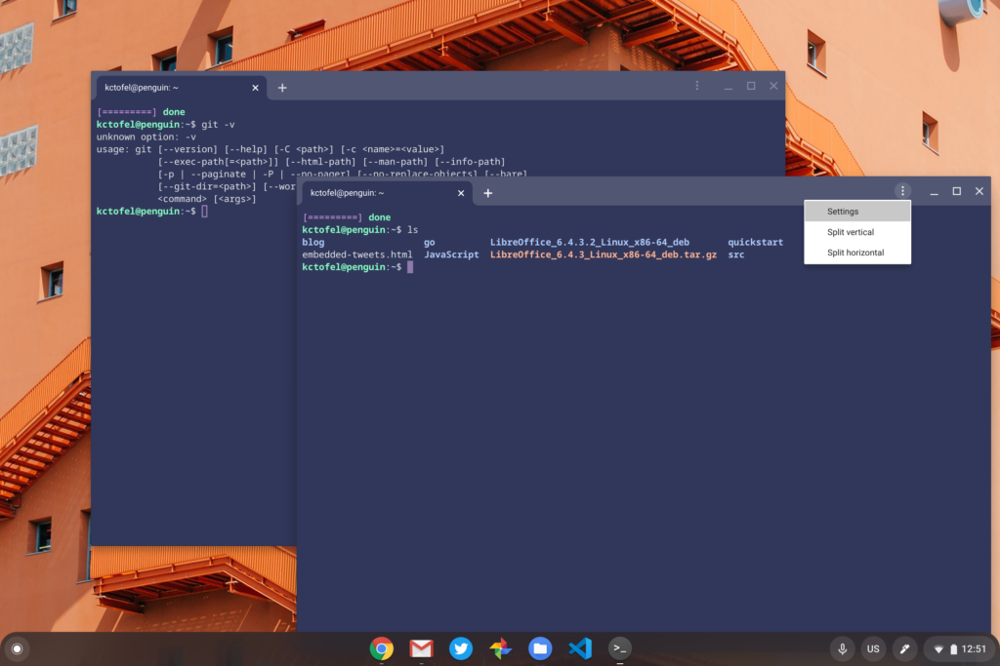
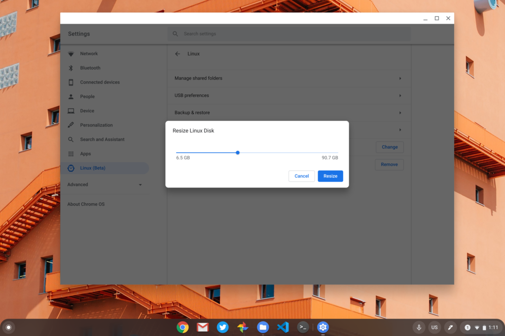
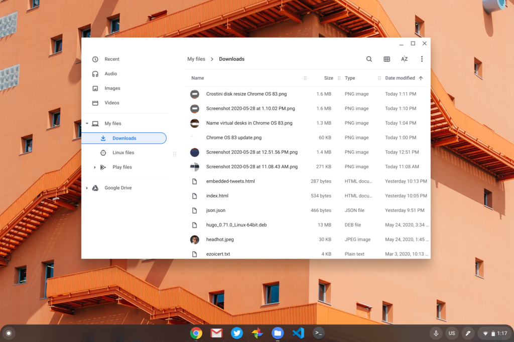
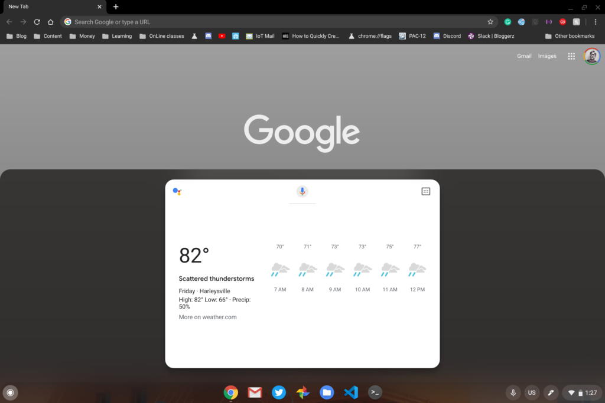
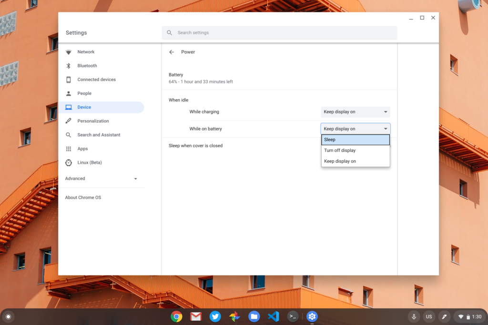

After making [Chrome OS 81 available](https://www.aboutchromebooks.com/news/chrome-os-81-stable-channel-release-what-you-need-to-know/) and then [skipping Chrome OS 82](https://www.aboutchromebooks.com/news/chromebooks-skip-chrome-os-82-due-to-covid-19/), the next version of the software for your Chromebook has arrived: [Chrome OS 83 has landed on the Stable Channel](https://chromereleases.googleblog.com/2020/05/stable-channel-update-chrome-os.html).

According to the [Chrome OS release update matrix](https://cros-updates-serving.appspot.com/), it should be generally available for most supported Chrome OS devices as I only see two exceptions currently: The Samsung Chromebook 3 and the Haier Chromebook 11 G2. Keep in mind that most releases are on a rolling basis so you might not see the update on your device immediately.

As I usually do, I'll cover what Google says is in the latest Chrome OS software and follow up on additional features or functions tucked away or hidden behind an experimental flag.

### It's all about Family Link, according to Google

An official Google blog post puts the spotlight on a much-improved family experience for Chromebooks. First is access to Chrome Web Store extensions for child accounts in [Family Link](https://www.aboutchromebooks.com/news/family-link-chromebook-parental-controls-for-kids-screen-time-limits-site-whitelisting/). This allows kids to hit the Chrome Web Store for extensions but not install them unless a parent who is a [Family Link](https://families.google.com/familylink/) admin approves it. I wish parents could approve the extension remotely through the Family Link app but it appears that approval requires parents to be signed in on the managed Chromebook.

Supervised web extensions on Chrome OS with Family Link

Next are fine-grain controls so parents can manage their kid's screen time using configurable per-app time limits of Play Store apps. Sorry kids, just one hour of Roblox a day! Since my kids are older, I don't manage their devices and haven't tested either of these new features.

Roblox time limit set by Family Link in Chrome OS

#### So what else is in Chrome OS?

Only [Chrome OS for enterprise gets publicly available release notes](https://support.google.com/chrome/a/answer/7679408#83) and there are a few items worth mentioning in this update.

Chrome Tab Groups are available now, allowing you to group browser tabs and choose a color for the group. You might want some "work" tabs grouped together, for example, while bundling social media tabs in another group. [Google announced this feature earlier this month](https://blog.google/products/chrome/manage-tabs-with-google-chrome/), and it is in Chrome OS 83 but not enabled by default on my machine.

To use it, I had to hit `chrome://flags/#tab-groups` and enable the flag. You may need to do the same on your Chromebook. As a side-note: I didn't see a way to pin a tab group or a tab in a group; doing so removed my tab from the group. Even by enabling `chrome://flags/#tab-groups-collapse`, I wasn't able to collapse the grouped tabs.

Chrome Tab Groups

If your device didn't get the [new Chrome OS tablet gestures](https://www.aboutchromebooks.com/news/chrome-os-81-stable-channel-release-what-you-need-to-know/) in the last release, you should have them now. These are available for all Chrome OS devices that support tablet mode. That means not just pure slate tablets but also 2-in-1 convertible Chromebooks when placed into tablet mode. Here's a [rundown of the Chrome OS gestures if you're not familiar with them](https://support.google.com/chromebook/answer/9739838).

#### Give me that stylish new Linux terminal!

Finally after teasing it over several channels and releases, the improved Terminal app is present in Chrome OS 81. Technically, it was there before and it's still hidden behind a flag, but this time, it actually works. With Chrome OS 81, I was able to preview themes and settings but couldn't get the Terminal itself working.

Yes, you still have to enable the `chrome://flags/#terminal-system-app` and `chrome://flags/#terminal-system-app-splits`, but once you do, you get the new settings and the ability to have multiple terminal sessions in a single window. And like most Chrome OS system apps, you can pull a Terminal tab out of a multi-tab Terminal session and it will stand alone.

Originally, I had both session tabs in a single Terminal but below I broke them apart:

#### Name that virtual desktop

Instead of having default names for virtual desktops, you can now right-click the name of one and assign it whatever name you'd like. It's not a huge improvement but it's a nice to have feature.

#### Almost resize that Linux container

In a prior release, Google added the ability to choose the initial size of the Linux container for Chrome OS but subsequent size changes weren't working. This experimental feature has progressed in Chrome OS 83 but failed to work in my testing.

I only mention it as it could be due to my container running the new Buster release instead of Stretch. All new containers now use Buster but if you have a Stretch container, this might work for you. You'll need to enable chrome://flags/#crostini-disk-resizing to try it but do so at your own risk.

#### Preview the new Files app

Google has been working on a redesigned native Files app and you can preview it in Chrome OS 83. You'll have to enable this flag `chrome://flags/#filesng` to see it though.

So far, all I've noticed is a different coat of paint and no new features or settings. But then again, I'm impatient. Maybe I missed something?

#### Hey Google Assisting, do my routine bidding...

Yet another experimental feature is additional functionality to the built-in (but optional) Google Assistant on Chromebooks. With the `chrome://flags/#enable-assistant-routines`, you can use... wait for it.... Google Assistant Routines! These are custom automations you must have set up prior.

For example, I have a "bedtime" routine that turns off all of my home's lights and shows the weather for tomorrow on my phone or a Nest hub. Now, with the flag enabled, the same voice command activates the routine from my Chromebook, showing the weather on its display.

#### Protect that power

Lastly is a new feature that's _not_ experimental, so there are no flags to mess with. It's just there. Head to Settings, Device, Power in Chrome OS and you can configure the display settings to be different when connected to an outlet compared to running on battery power. Thank you, Google as this was long overdue and sorely needed!

That lists the new features I've found so far, but I'll be on the lookout for more. Please let me know in the comments if you've found something worth a mention and I'll be sure to update the post with anything we find.
