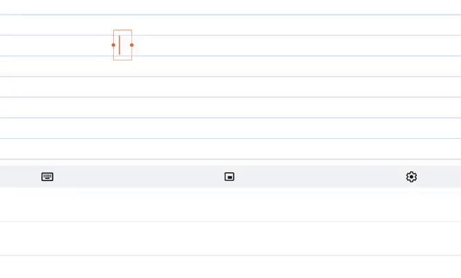

The [Chrome OS 85 Stable Channel release arrived a few weeks ago](https://www.aboutchromebooks.com/news/chrome-os-85-stable-channel-arrives-heres-what-you-need-to-know/) and while there was an official mention of handwriting improvements, there was something included that wasn't mentioned. [Android Police noticed that Chrome OS 85 has AI-based handwriting recognition](https://www.androidpolice.com/2020/09/11/chrome-os-85-significantly-improves-the-handwriting-keyboard-for-some-chromebooks/) that works both on- and offline. That means a pen-enabled Chromebook can better translate sloppy writing into actual text with more accuracy.

Here's a demonstration of the updated handwriting recognition feature in action:

_Credit: Android Police_

There's [another video demo on Reddit here](https://www.reddit.com/r/chromeos/comments/ilh37c/chrome_os_85_upgraded_handwriting_keyboard_with/) showing the feature in action with a little more cursive writing.

## How does it work offline and what Chromebooks have it?

Code commits show a specific local AI model library called `[libhandingwriting.so](https://source.chromium.org/chromiumos/chromiumos/codesearch/+/master:src/platform2/ml/handwriting.cc;bpv=1;l=21)` is part of some Chrome OS 85 builds. All of the handwriting can then be quickly processed locally, which is great. Even better is that the model can be updated over time in future Chrome OS updates for additional accuracy.

Now before you whip out that Chromebook and stylus to test the handwriting recognition with your own scrawl, bear in mind that not all pen-enabled devices support this. Notably absent, for example, is the [Lenovo Chromebook Duet](https://www.aboutchromebooks.com/tag/lenovo-duet-chromebook/), perhaps because of the ARM processor inside.

[XDA Developers put the below handy list of supported devices together](https://www.xda-developers.com/chrome-os-85-vastly-improves-handwriting-recognition-for-some-chromebooks/) and to be honest, there are a good number of models are on the list.

- “eve”: Google Pixelbook
- “sarien”: Dell Latitude 5300 2-in-1, Latitude 5400
- “soraka”: HP Chromebook x2
- “octopus”: Several ASUS, Acer, HP, Lenovo, and Samsung Gemini Lake Chromebooks
- “nami”: Acer Chromebook 13 / Spin 13, Dell Inspiron 14 2-in-1 Model 7486, Lenovo Chromebook C340-15, Lenovo Yoga Chromebook C630,
- “rammus”: ASUS Chromebook Flip C434, ASUS Chromebook C425, ASUS Chromebook Flip C433TA
- “nautilus”: Samsung Chromebook Plus (V2), Samsung Chromebook Plus LTE
- “hatch”: ASUS Chromebook Flip C436FA, Acer Chromebook 712, Lenovo IdeaPad Flex 5i, Samsung Galaxy Chromebook
    - “nocturne:” Google Pixel Slate

There's no experimental flag to enable if you want to try the new handwriting recognition; this is baked right in to the Chrome OS 85 Stable Channel on the above listed devices.
