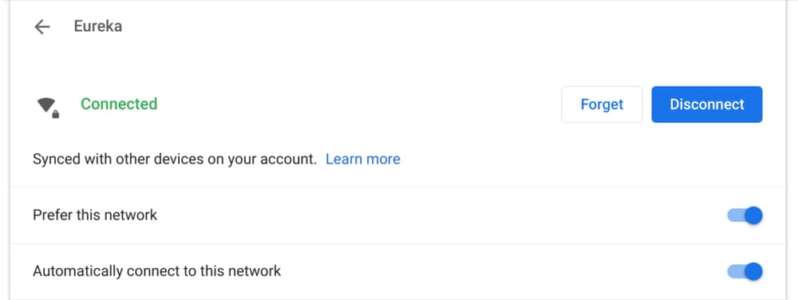

On Tuesday, [Google announced that the Chrome OS 85 Stable Channel is released](https://blog.google/products/chromebooks/whats-new-chrome-os/sept2020/), with the typical staggered rollout over the coming days. As usual, Google has highlighted some of the newest features for Chromebooks, but there's always more in terms of experimental functionality.

I'll share what you need to know about Chrome OS 85 from the official release and cover thee additional items Google has held under wraps for now.

## Wi-Fi password sync between Chromebooks

We knew that [WiFi password synchronization between Chromebooks was coming](https://www.aboutchromebooks.com/news/chrome-os-may-sync-wi-fi-configurations-between-your-chromebook-and-android-phone/) and it's finally here in Chrome OS 85. This is ideal for people or families that use multiple Chromebooks in the same location, and therefore, likely on the same network. Why? Because Wi-Fi passwords are part of your profile’s keychain, so they move from Chromebook to Chromebook. No word on if this feature will also include Android phones, although it likely will in the future.

## Search bar in Chrome OS Settings

This is a long overdue improvement for finding different settings on a Chromebook. Not only does the Search bar find your exact queries but it's smart enough to suggest related results, as shown above. Usability in the Chrome OS Settings has been adequate but I appreciate this new feature, which I've been using on the Chrome OS 86 Dev Channel.

## Say hello to the new microphone slider

With so many people and students working or studying at home, video conferencing usage is up. So this new microphone volume slider is a welcome addition to Chrome OS 85. There's no need to jump into the settings for Hangouts, Meet, Zoom or whatever video chat service you use now; you can just click and slide!

And speaking of video, the Camera app can now pause and resume video while recording, or take a still snapshot during a video. All videos are saved in MP4 format, making it easier for others to view your content, although I don't see too many people creating sharable video with a Chromebook.

That's all that Google is _officially_ highlighting for Chrome OS 85 in it's news release, so let's hit the other goodies from the Chrome Enterprise release notes and other sources:

- The "Displays" page in Settings has been updated to allow independent configuration of the resolution and the refresh rate for external monitors. This setting will be split automatically and users do not need to take any action.
- When entering text using the handwriting keyboard, you can now use familiar gestures to edit your handwriting. Drawing a strikethrough will delete text, and a caret will give you space to insert text.
- Users can now manage their ongoing print jobs and view what has been completed.
- As previously mentioned, [Chrome tabs open up to 10 percent faster and can be grouped](https://blog.google/products/chrome/organize-your-tabs-and-stay-productive-chrome/).

I have to dig through the code commits (and there are a lot of them!) in lieu of additional release notes, so as I find other items or experimental flags, I will update this post accordingly.
