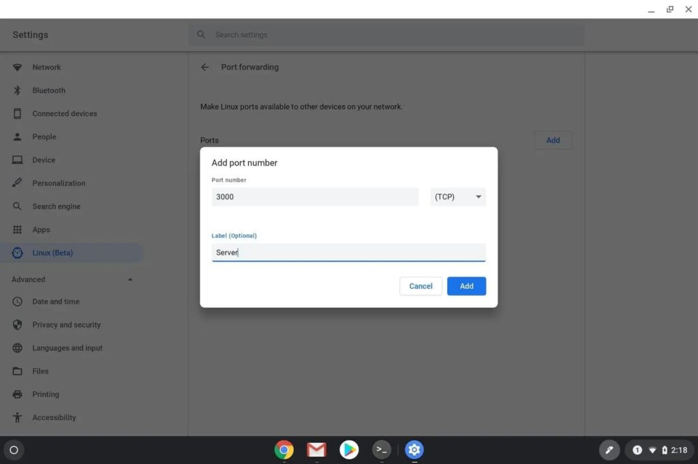

As I keep running the Dev Channel of Chrome OS 86, I'm seeing more features of the software moving forward. For example, [port forwarding, which was enabled with an experimental flag in Chrome OS 84 and 85](https://chromeos.dev/en/web-environment/port-forwarding), is a native, generally available feature in the next Stable Channel release. Chrome OS 86 removes the port forwarding flag.

As shown above in Chrome OS 86, even without the flag available, "Port forwarding" appears in the Linux settings.

To configure it, simply choose the Port forwarding option and enable your ports and protocols as needed:

You might be wondering what you even need this feature for. If you are, you probably don't need it. ;)

Essentially, this is a way for Chrome OS to access a web app or a other container running in Linux. Without port forwarding, you wouldn't be able to access the web app in Linux through the browser in Chrome OS for security reasons.

By forwarding access or output from Linux through a port that Chrome OS can access, this allows for safely viewing or using the web app in development or installed in the Linux container. This should also allow other devices on the same network to use the app for testing purposes, such as on phones or tablets.

Yeah, not a feature for everyone, of course. Developers using Chromebooks, like me, will be thrilled to see this functionality as previously it required workarounds or other configuration methods, without any guarantee of success. But even folks who eventually might turn to Linux for some activity could use this in the future.

With Chrome OS 86 it will be easier to enable and configure port forwarding. If you do need this function, remember that you can enable it in the [just released Chrome OS 85 Stable Channel](https://www.aboutchromebooks.com/news/chrome-os-85-stable-channel-arrives-heres-what-you-need-to-know/). Simply browse to `chrome://flags/#crostini-port-forwarding` and turn the feature on.
