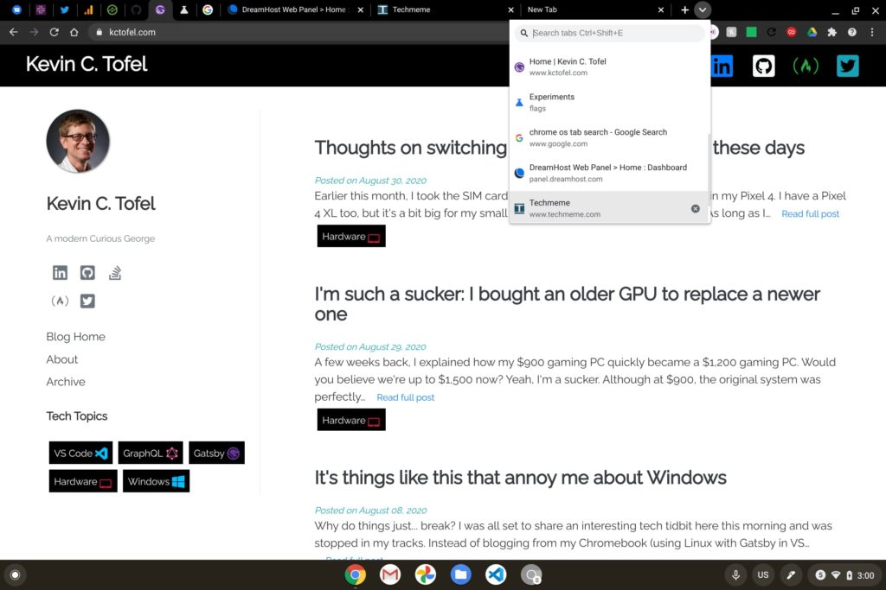

Earlier this week the [Stable Channel of Chrome OS 85 was released to Chromebooks](https://www.aboutchromebooks.com/news/chrome-os-85-stable-channel-arrives-heres-what-you-need-to-know/). Hot on the heels of that, the Chrome OS 86 Dev Channel was updated and I've been using it on my daily driver. If you're the kind of Chromebook user I am and have one or two dozen tabs open at any given time, you're likely going to love the new tab search feature.

Here's a screenshot of it in action:

Above you can see I have 9 pinned tabs, two regular active tabs and a new tab page, just for good measure.

By clicking on the drop down arrow to the right of the last tab shown, there's a dropdown menu of all open tabs. You can't see all of them but at least five do appear. And typing in the search bar will, of course, search through all of your active tabs.

There's currently a keyboard shortcut to open this menu as well: It's CTRL + Shift + E, if you'd rather not mouse or tap around.

This feature is enabled by default in the Chrome OS 86 Dev Channel, although I suspect you can enable it in Chrome OS 85 behind this flag: `chrome://flags/#enable-tab-search`

Since this is on by default with the Chrome OS 86 Dev Channel, I fully expect this to arrive for everyone on the Stable Channel when Chrome OS 86 is released in roughly six weeks.

Granted, if you're just doing some basic browsing with a few tabs, you likely won't need this feature. Once that row of browser tabs fills up though? You'll probably be all over this new addition to Chrome OS 86.
