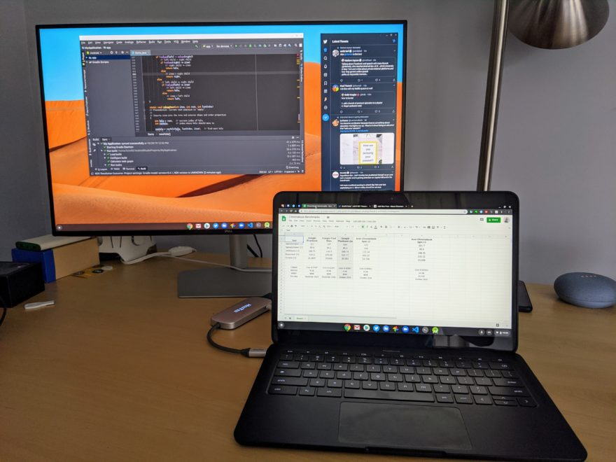

There aren't too many Chromebooks, save for the [Samsung Galaxy Chromebook](https://www.aboutchromebooks.com/tag/samsung-galaxy-chromebook/), that can appropriately display video content in HDR, or High Dynamic Range, which in my opinion is a bigger bang for buck than 4K output. However, there are some HDR-capable Chromebooks in the works, according to an internal Google document, and although [Chrome OS 85 was going to support HDR playback, the feature is now targeted for Chrome OS 86](https://bugs.chromium.org/p/chromium/issues/detail?id=1101011).

First, a direct quote from a document entitled _[HDR on ChromeOS and Beyond](https://docs.google.com/document/d/1h_I2jfsfTu007W6hdQtEA4ggwU2KzoZsU81hKQyIHW8/edit#)_:

"Upcoming ChromeOS hardware has new capabilities. In particular:

- Very wide (more than P3) gamut
- High-ish dynamic range (~600 nits)
- 10-bit color per channel
- A funky new transfer function for HDR content"

So there's the glimpse indicating that some higher quality displays are in the works, likely for higher-end Chromebook models, at least at first. Depending on the display brightness and color gamut support of current hardware, a few models might be bright enough to give a taste of HDR at 400 nits, but you really want 600 or even 1,000 nits of brightness when in HDR mode for optimal conditions. And there's the color gamut requirement as well.

[This image from StackExchange](https://photo.stackexchange.com/questions/21332/how-does-photography-for-digital-display-only-differ/22531) shows available colors in different supported gamuts. Look at the Wide Gamut as compared to traditional sRGB and you can see much more color space in the greens and blues, for example. These colors "pop" more on screen as a result with an HDR panel paired with HDR playback support.

If you're not familiar with HDR display requirements, [this chart from Wikipedia](https://en.wikipedia.org/wiki/High-dynamic-range_video) might help. Note that the vast majority of Chromebooks out in the wild today don't even meet the lowest standard on the chart.

\*WCG stands for Wide Color Gamut

Hopefully, this explains that for true HDR content support on Chromebooks, you'll need a display panel with higher peak sustained brightness that screens used in most devices today and, of course, support for a Wide Color Gamut. There are other standards involved, such as HDR-10, Dolby Vision and more, but that's another discussion for another time and has more to do with the video formats, codecs and transfer functions.

According to the code change log for this feature, HDR playback was going to be hidden behind an experimental flag. Earlier this month, however, it was decided to [make this an actual option in the Chrome OS Settings area](https://chromium-review.googlesource.com/c/chromium/src/+/2276516), with choices of "Disabled", "Enabled", or "Default", like many other base settings:

> This CL changes the switch kEnableUseHDRTransferFunction to a base::FeatureFlag kUseHDRTransferFunction which is more adequate to after-launch, where users will like to see the hdr-ness state as "disabled" "enabled" or "default", as opposed to having a naked flag where the correspondence chrome:flags<->feature status is non-intuitive.

There's much more technical information on how this will all work in [another internal document called _HDR video on CrOs_](https://docs.google.com/document/d/1OPh_WssH1ObmApIg7k2COcqeteWqZd10pb6GQh-EqLw/edit#heading=h.q76ll1p64g4h) if you're interested.

But for most Chromebook users, it all comes down to this: Within the next few months Chrome OS will support HDR playback. You _may_ see a very slight improvement in brightness and color saturation for video, depending on the panel of your device. However, to get the full HDR effect (and once you've seen it, you'll likely want it with all other supported content), you're either going to need a new Chromebook with a better display panel or an external monitor that supports HDR.

I mention the latter option based on this comment in the document mentioned just above: When asked about HDR support through USB-C, the response was yes:

> It should, yeah, in particular: it should work out of the box with USB-C to DP adapters, and perhaps needs some extra tweaking for USB-C to HDMI adapters.

Although [my most used Chromebook, the Acer Chromebook Spin 13](https://www.aboutchromebooks.com/news/acer-chromebook-spin-713-is-a-project-athena-refresh-of-my-daily-driver-the-chromebook-spin-13/), doesn't have an internal display that can support HDR playback, I did recently purchase an 144Hz widescreen HDR gaming monitor. Rather than replace my Chromebook, I'll likely use [my USB-C hub](https://www.aboutchromebooks.com/news/the-best-home-and-travel-accessory-for-my-pixel-slate-is-this-usb-c-hub/), which includes an HDMI out port, with that laptop for true HDR playback.

