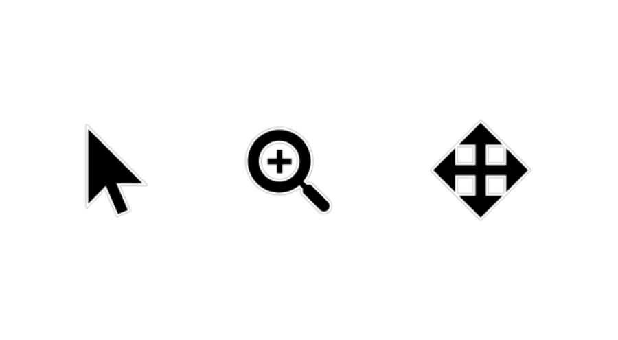
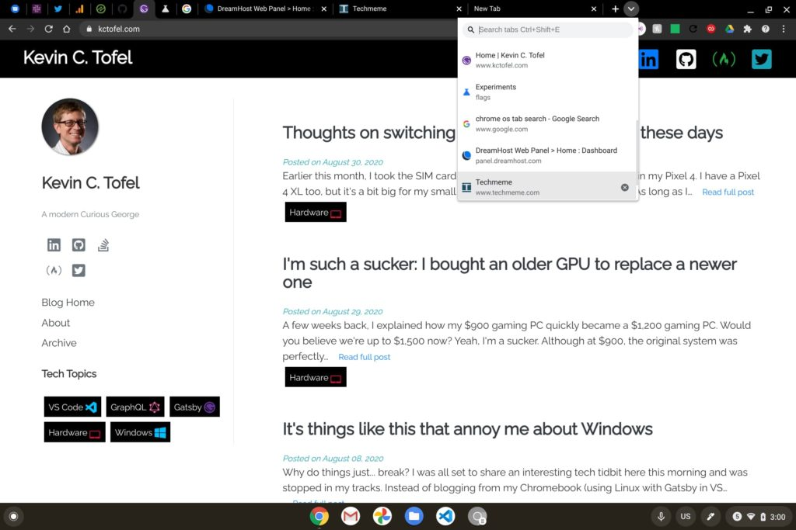
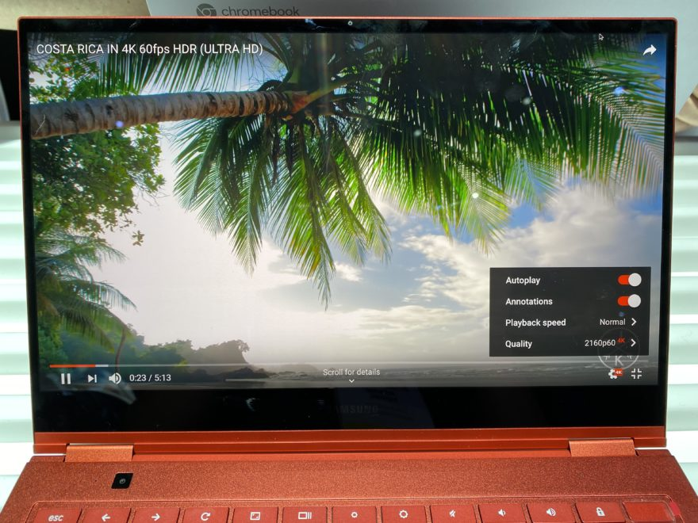
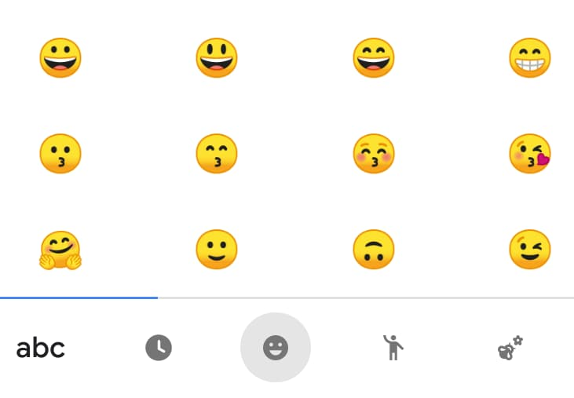

Earlier this week, [Google announced the Stable Channel release of Chrome OS](https://chromereleases.googleblog.com/2020/10/stable-channel-update-for-chrome-os.html), although the [Acer Chromebook Spin 713 I recently reviewed](https://www.aboutchromebooks.com/news/acer-chromebook-spin-713-review/) hasn't received the update yet. There are a few other Chromebook models that haven't as of the time of writing; [you can look for your Chromebook here to see if the update is available](https://cros-updates-serving.appspot.com/). Instead of waiting for the update and sharing all of the latest features in it like I normally do, here's a rundown of what you need to know about Chrome OS 86.

For starters, Google is recognizing that October is Disability Employment Awareness Month in the U.S. and [highlights several Chrome OS accessibility features in this release](https://blog.google/products/chromebooks/whats-new-chrome-os/oct2020/).

You can now change the color of your cursor between red, yellow, green, cyan, blue, magenta, and pink. This can be useful for the visually impaired who are challenged by viewing certain colors. Of course, anyone can take advantage of the feature to spice up the cursor. Just look for the option under settings for your “Mouse and touchpad”.

Chrome OS has had a text to speech reader prior to Chrome OS 86 but with this release, it gets a nice improvement. You can configure "Select to speak" to shade background text so that it's easier to see the words that are being spoken. Along the same lines, the built-in screen reader, called ChromeVox, can now detect on-screen language and speak aloud in that language automatically. Think of it as a smart Google Translate function for people with limited or no vision.

And as announced in July, Chrome OS now saves tagged PDFs for improved accessibility:

> A tagged PDF is one that contains extra metadata about the structure of a document, including things like headings, lists, tables, paragraphs, and image descriptions. Tagged PDFs are more accessible to users with disabilities, such as blind users who use a screen reader to access PDF files. Tagged PDFs can have other uses too, like making it easier for software that needs to automatically process and extract data from PDFs.

Of course, there's more in Chrome OS 86 than the accessibility features.

[Tab searching, for example, lets you search through your open tabs](https://www.aboutchromebooks.com/news/chrome-os-86-bringing-tab-search-to-chromebooks-and-its-awesome/). Since I don't yet have Chrome OS 86, I don't know if this feature is still hidden behind an experimental flag. If it is, `chrome://flags/#enable-tab-search` should enable it.

As I noted back in July, [Chrome OS 86 brings HDR playback capabilities](https://www.aboutchromebooks.com/news/chrome-os-86-hdr-video-playback-support-for-chromebooks/) to those devices that can support it.

The obvious benefactor here is that lovely 4K OLED display on the Samsung Galaxy Chromebook. However, Google offers hope for folks (like me!) that have an HDR-capable external monitor, saying "certain Chromebook models will support HDR with an HDR-capable external monitor." Once I get the Chrome OS 86 Stable Channel update, I'll try playback on my 1440p / 144 fps HDR gaming monitor.

The Chrome OS media gallery gains improved image editing tools such as cropping and filters. I've been testing those in the Dev Channel of Chrome OS 86 for a few weeks and I think most people will like what they see. I wouldn't call this a full-featured set of photo editing tools though, so there's still work to be done. Well, unless Google wants third-party apps and services to step in.

Here's another nice feature in Chrome OS 86: Automatic emoji suggestions when using either your Chromebook's physical keyboard or on the on-screen, software keyboard. Google says these will appear "in select context, such as messaging applications."

Personally, I can't stand using the on-screen keyboard just for emojis, so I'm looking forward to this!

Chrome OS 86 also makes a few changes to the login screen.

> Simply click the eye-shaped icon to show password/PIN in clear text, review or compare with your password manager, and then submit. For security, we will turn the clear text into \*\*\*\*\* after 5 seconds of inactivity and clear the entire input after 30 seconds of inactivity.

And if you log in with a PIN, you'll no longer have to tap the Enter key on your keyboard to submit the PIN. You just type it and you're in.

For you clipboard-aholics, the [enhanced Chrome OS clipboard found by Chrome Story in July](https://www.chromestory.com/2020/07/first-look-enhanced-clipboard/) is available in Chrome OS 86. Up to five of the most recently saved clips are available now, which is super handy! You'll want to enable this experimental feature at `chrome://flags/#enhanced_clipboard`. Once you enable it and restart your browser, tapping `Ctrl + V` brings up the five most recent items stored on the clipboard.

That's all for now until I get the Stable Channel update and do some additional digging and verification to see what features have made to cut from Dev and Beta. Don't hesitate to drop any of your own Chrome OS 86 findings in the comments!
