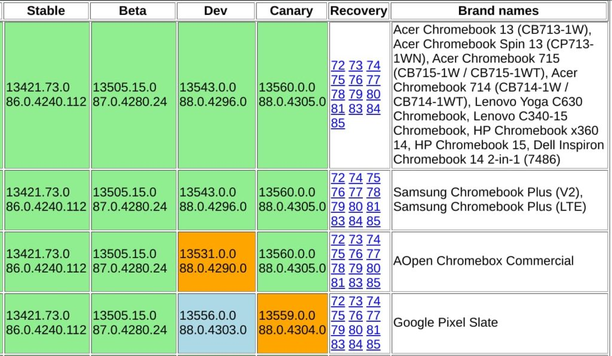

Earlier this week, I reported that [the latest Chrome OS 86 Stable Channel update stopped flowing to Chromebooks](https://www.aboutchromebooks.com/news/google-pulled-chrome-os-86-stable-channel-update-from-most-chromebooks/). Indeed, even two weeks [after news of the software update was announced](https://chromereleases.googleblog.com/2020/10/stable-channel-update-for-chrome-os.html), many Chromebooks weren't seeing the new software. I've been keeping an eye [on the update matrix](https://cros-updates-serving.appspot.com/) and it now shows the Chrome OS 86 Stable Channel update is once again available for nearly all Chromebooks and Chromeboxes.

A few readers have commented in the past 24 to 36 hours that their devices were now getting updated. And my own [Acer Chromebook Spin 13](https://www.aboutchromebooks.com/news/acer-chromebook-spin-13-with-16-gb-ram-should-you-buy-one/) finally got upgraded to the Chrome OS 86 Stable Channel late last night.

So even though there's been no official communication from Google on this subject, I think it's safe to say the update process is moving forward. Bear in mind that Google typically rolls out Chrome OS software over several days, so you still might have to wait for just a bit.

Now the question is: Why was Chrome OS 86 released, halted and then re-released?

We'll never know unless Google decides to share that information. However, over the past few days, I did see several Chrome OS 86 bugs reported, many of which I'd consider "high priority". Some folks were [experiencing major Family Link issues](https://support.google.com/chromebook/thread/78141071?hl=en), others lost all ability to print and still others [experienced Android app crashes](https://support.google.com/chromebook/thread/78902770?hl=en). And those were just the bugs I could publicly find.

Regardless of the reason, I'm looking forward to using some of the new Chrome OS 86 features that I had tested previously in the Dev and Beta channels. [Hop over here for a list of what's new in Chrome OS 86](https://www.aboutchromebooks.com/news/chrome-os-86-stable-channel-arrives-on-chromebooks-what-you-need-to-know/) while you wait for that update!
