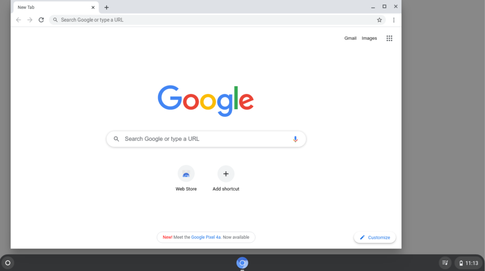
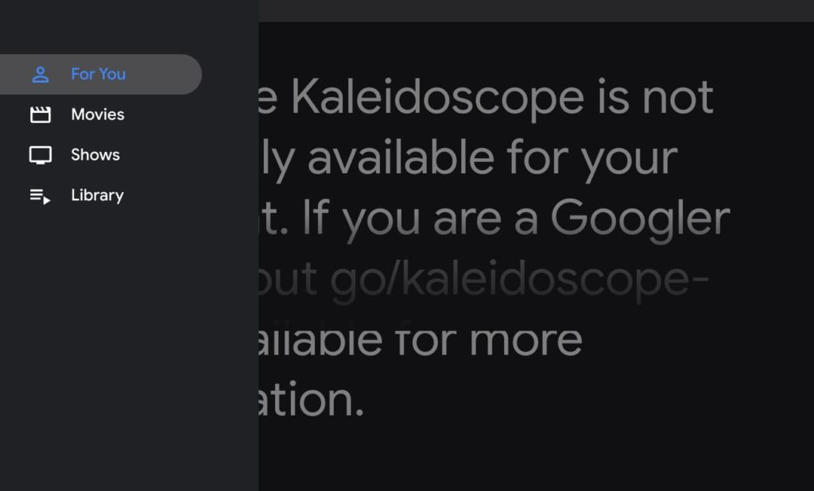

Google has been slowly fleshing out media playback functions on Chromebooks for some time now. Most recently was the addition of media playback controls in the Chrome OS notifications area. With Chrome OS 86, it looks like [there will be a dedicated Global Media Controls icon on the right side of the system shelf](https://chromium.googlesource.com/chromium/src.git/+/4675273693488137fbb007879ef9f7119d8b6f5f/ash/resources/vector_icons/global_media_controls.icon).

Here's a mockup of the icon in the system shelf, which isn't super exciting to look at, but gives you an idea of what to expect:

The code commits for this new icon don't really get into specifics of usability.

There's no mention of what the interface will be like when tapping on the icon, but [the code shows a tooltip value of "Control your music, videos, and more"](https://chromium.googlesource.com/chromium/src/+/4675273693488137fbb007879ef9f7119d8b6f5f/ash/ash_strings.grd). I see several experimental flags mentioning the "Global Media Controls" in Chrome OS 86 on the Dev Channel but even when enabled, it doesn't appear there is any functionality yet available in this regard.

I am wondering if this icon has anything to do with the [new "Kaleidoscope" feature that Chrome Story reported on early this month](https://www.chromestory.com/2020/08/chrome-kaleidoscope/). That will supposedly be a way to gather up and aggregate media content from various online sources to your Chromebook. I'm wondering if those videos will even be available offline; perhaps I'm too optimistic though.

And based on a little tinkering I did with the Kaleidoscope page JavaScript, it appears those sources will be video only, at least initially:

My take is that as Google builds the backend for Kaleidoscope over time, it has to get the user interface elements in place before launching the service. So while the Global Media Controls icon may come with Chrome OS 86, you may not see it or find that it does anything until a later version when Kaleidoscope actually launches.
