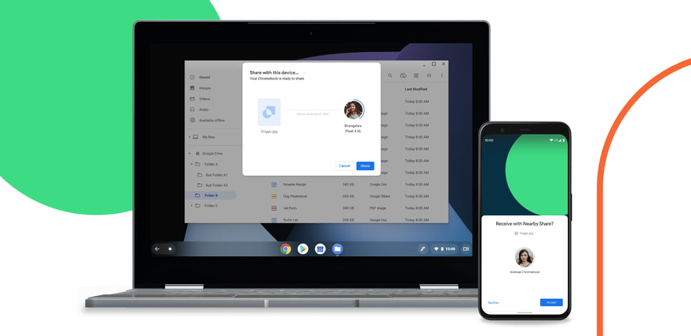
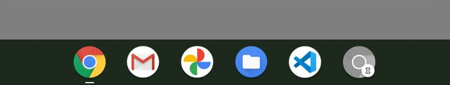
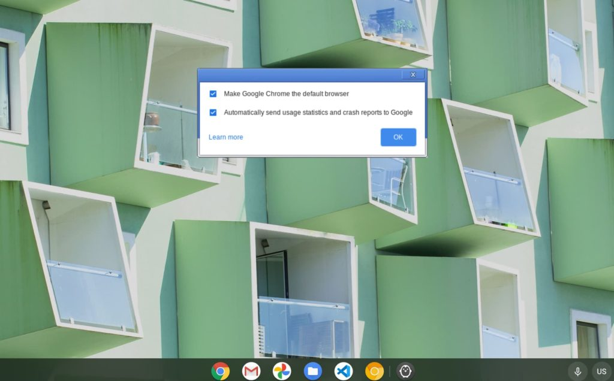
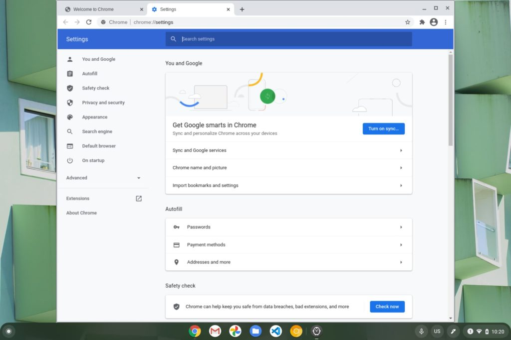
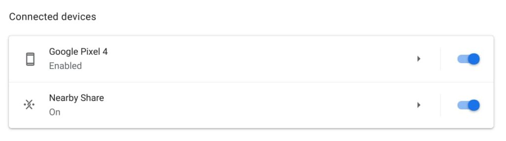
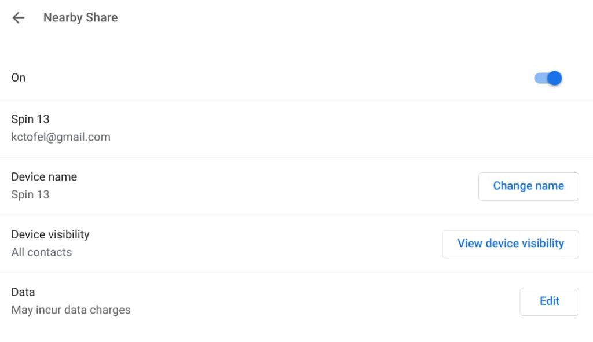
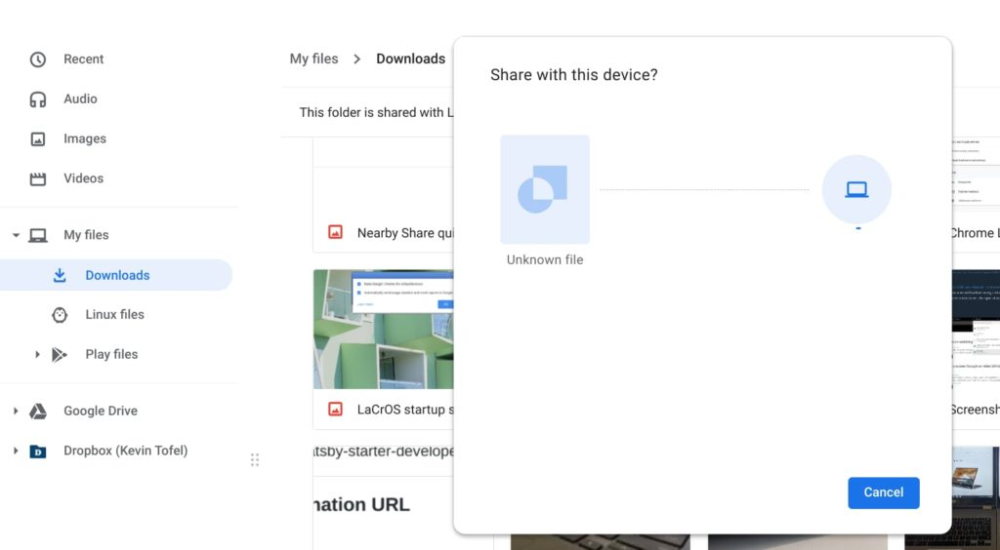
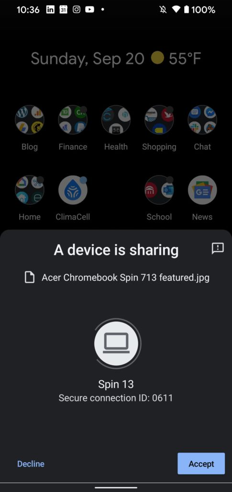

Can't wait to try the latest upcoming features of Chrome OS? You're in luck if those features are LaCrOS and Nearby Share of files to Android phones. The latest Dev Channel for Chrome OS pushes both of these features to your Chromebook in a mostly working state.

My Chromebook got the Chrome OS 87 Dev Channel upgrade over the weekend and I noticed I could test these features out. If you're not familiar with them, here's a short recap.

[LaCrOS is an effort that separates the Chrome browser from Chrome OS](https://www.aboutchromebooks.com/news/what-is-lacros-for-chromebooks-and-why-does-it-matter/), which is a major change. You might not notice that change from a usage perspective but for Google, it brings a more modular approach to Chrome OS. The company will be able to update the Chrome browser at any time without pushing a full Chrome OS upgrade, which typically occurs every 6 weeks.

[Nearby Share is essentially Google's version of Apple's AirDrop functionality](https://www.aboutchromebooks.com/news/nearby-share-an-apple-ios-airdrop-like-wireless-feature-on-chromebooks-chrome-os-86/). With it, you can wirelessly push a file from an Android phone to a Chromebook, or vice versa. I should note that as of now, the feature is working from Chrome OS to Android, but I haven't been able to push a file from my Surface Duo or Pixel 4 to my Chromebook. Future software updates will certainly address that.

If you want to try either or both of these features, you'll need to [switch to the Chrome OS Dev Channel, which is easy to do](https://www.aboutchromebooks.com/qa/whats-the-difference-between-developer-mode-and-the-dev-channel-on-a-chromebook/). However, if you decide to switch back to either the Beta or Stable Channel, there is a chance that your Chromebook will be factory reset. That means you'll lose all of your local data. Basically, if you go from one Chrome OS version such as the Dev Channel of 87 and later revert to a lower version channel, such as 85 or 86, that's when the powerwash will happen. So be sure you're OK with this before switching over to the Dev Channel.

Assuming you are, you'll need to enable this flag to use LaCrOS: `chrome://flags/#lacros-support`. After that, click the restart button.

Once you do, you'll see a new Chrome browser icon in your dock. It may be grayed out, but will eventually turn yellow and you can can still click it to open a new browser window. That will greet you with the Linux version of Chrome, which you can set as your default browser. I wouldn't recommend that while LaCrOS is in development, but that's up to you.

After you've selected your settings, clicking the OK button brings you into Chrome and you're good to go.

Functionally, you shouldn't notice any major differences between using this Chrome browser and the one built into Chrome OS.

Once you sign in to Google, you can sync all of your settings and such. Note that any experimental flags you have set in Chrome OS don't carry over, so if you want to add any of those back, you'll have to hit `chrome://flags` in the Linux browser to re-enable them. I have noticed that the text looks a bit fuzzier in the LaCrOS browser, so I'm hoping that Google addresses the font sharpness before this feature is generally available.

As far as Nearby Share goes, you'll want to hop into your Chrome OS Settings to enable the feature. Make sure Bluetooth is turned on for both your Chromebook and your Android phone too.

You'll also want to configure which contacts you want to share files with. I've set mine up to anyone for now, mainly because I'm not leaving the house these days.

That should do it! Now, you can choose the Share option in the Chrome OS Files app and select Nearby Share. You'll need to select any nearby Android phones that have Nearby Share enabled, accept the share on that phone and then your file will be wirelessly transferred.

Bear in mind that the code for these aren't yet finalized, so expect some things to change in the coming weeks. And don't forget the risks to your local data if you plan to switch over to the Dev Channel!
