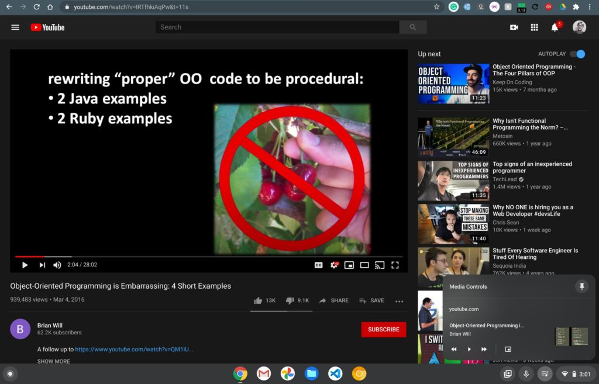
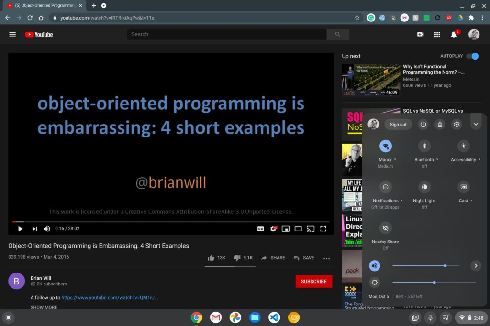
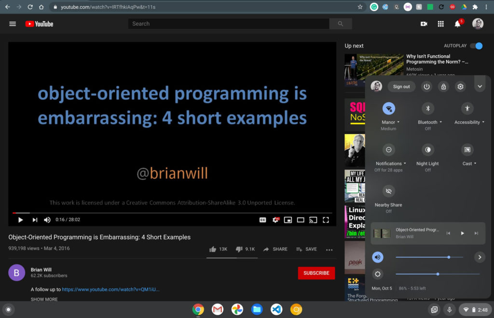
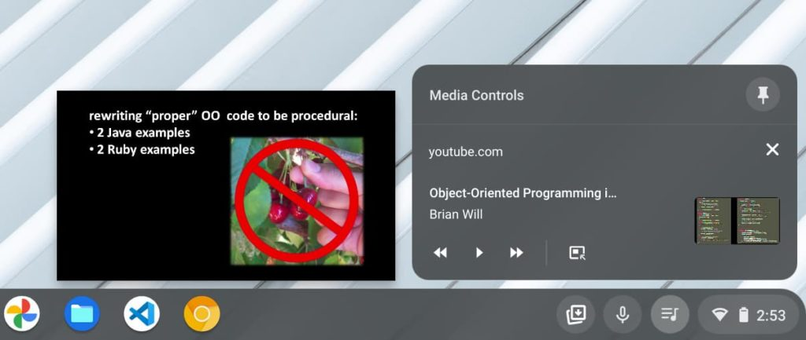

The [new Global Media Controls (GMC) feature in Chrome OS 87](https://www.aboutchromebooks.com/news/chrome-os-87-may-move-media-playback-controls-to-quick-settings-on-chromebooks/) may not look like a huge deal, but I'm thrilled to see how it's progressing. The latest Dev Channel update shows exactly what I was hoping for: No more of the (what I think) are annoying media playback features persistently stacked on your Chromebook notifications. Instead, you can choose to have media controls in the system tray or available from the tray icon.

Here's what I mean.

With the `chrome://flags/#global-media-controls-for-chromeos` flag enabled in the Chrome OS 87 Dev Channel, I have the new GMC icon in my tray. Clicking it while watching a YouTube video, for example, shows media information as well as play, pause and other controls:

There's also a thumbtack icon, but I'll get to that in a minute.

While playing the same YouTube video, I opened up my Chrome OS system tray and that ill-placed media control above the system tray and notifications was gone.

As it should be: **So say we all**. (Well, maybe not _all_, but I'm betting most of us.)

Now, about that thumbtack.

In this implementation, clicking the thumbtack removes the GMC icon from your system tray and moves the media info and controls to the Quick Settings. And it's a much better spot from a user interface perspective.

Here you can see where they reside after clicking the thumbtack, essentially "pinning" them below your quick controls:

I think this is a much improved implementation. You get the choice of where you want your media controls, either in the dock or the quick settings, and they don't interfere with constantly changing notifications.

One more thing: You might have noticed in the first image above there's a picture-in-picture (PIP) control in the GMC. That's not enabled by default currently, but you can turn it on with this flag: `chrome://flags/#global-media-controls-picture-in-picture`.

Obviously, I did that and the feature already works:

It's the little things in life that make me happy. :)
