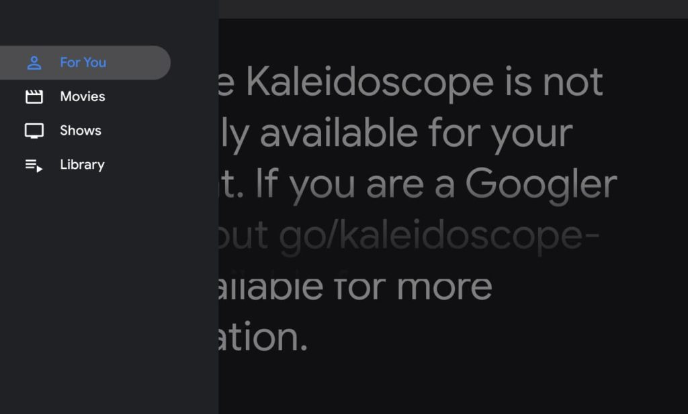

Last month, I pointed out that a [new Global Media Controls feature was in the works for Chrome OS 86](https://www.aboutchromebooks.com/news/chrome-os-86-to-add-global-media-controls-icon-in-system-shelf-on-chromebooks-kaleidoscope/). I didn't say it at the time, but my hope was that this would remove the annoying (at least to me) media playback controls in the Notifications stack on my Chromebook. It looks like I may get my wish with Chrome OS 87.

[Work has begun with a target version of 87 on media controls](https://bugs.chromium.org/p/chromium/issues/detail?id=1128883) right in the system tray, [as spotted by Chrome Story](https://www.chromestory.com/2020/09/media-controls-in-quick-settings/). Code only started appearing earlier this week, so much of what's planned could be changed, but here's a video demo of the current progress:

https://www.aboutchromebooks.com/wp-content/uploads/2020/09/gmc-quick-settings.mp4

You can see that already the Chromium developers have replicated the media control functionality currently available today on Chromebooks; the difference is that the new controls are in the System Tray.

I won't lie: That's where I think they _belong_. Having a persistent view of media playback every single time I view notifications drives me nuts, personally.

This still has me wondering about that media icon to the left of the system tray space seen in early versions of Chrome OS 86.

Will that be a shortcut to open the tray?

Nah, that doesn't make sense. Clicking either that icon or the tray area would open the Quick Settings in that case, basically replicating the same user action.

My bet is still on that icon being a shortcut to Kaleidoscope, the still-in-progress feature that will aggregate movies and television shows from online sources for browser playback. We'll have to wait and see.

As always, if you want to follow the status of this code change while it's in progress, you can [sign in and star the change here](https://bugs.chromium.org/p/chromium/issues/detail?id=1128883).
