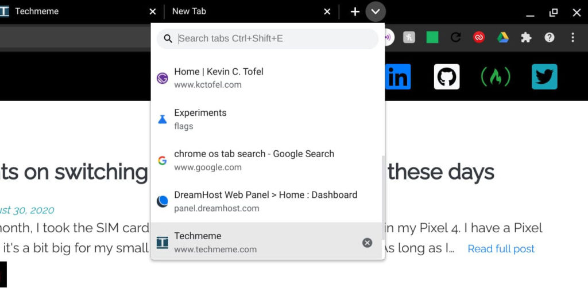
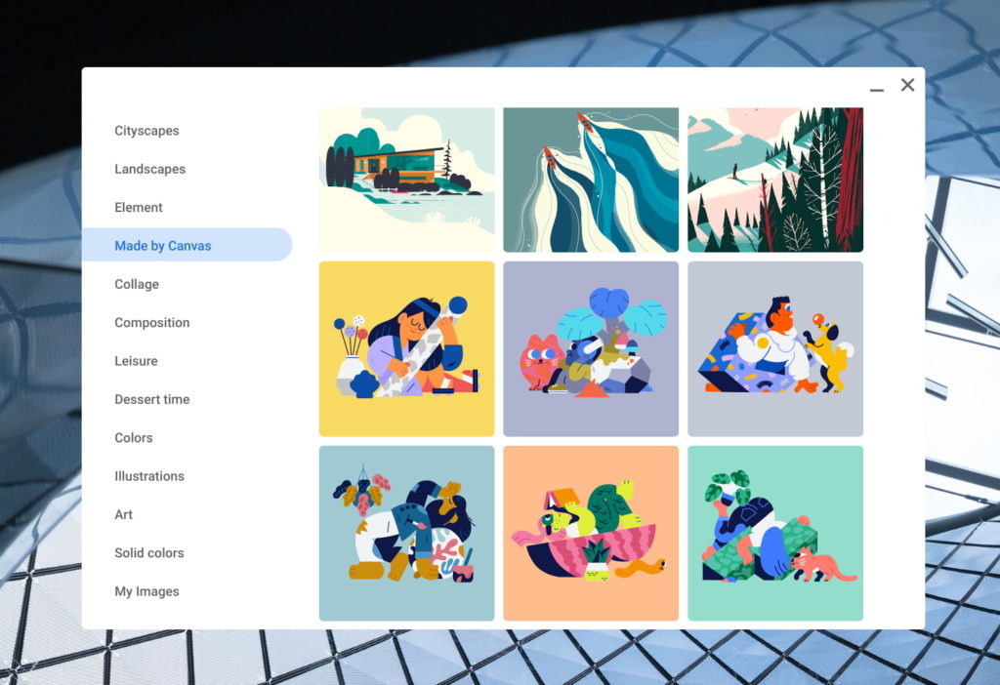
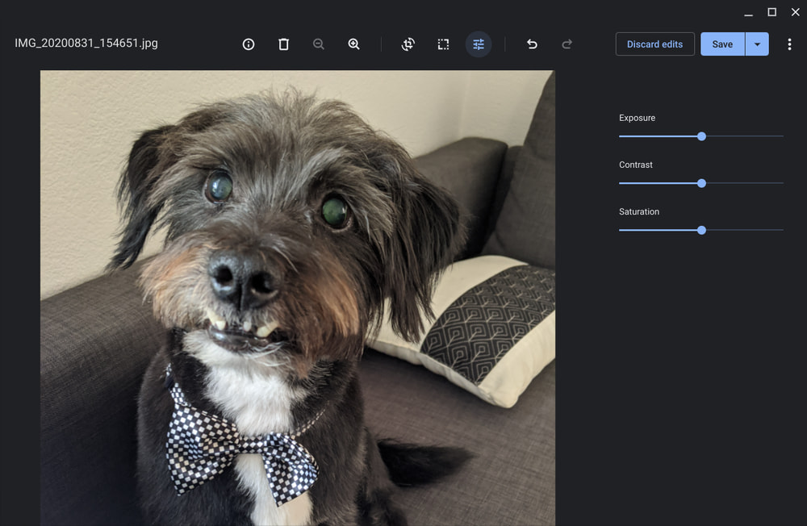
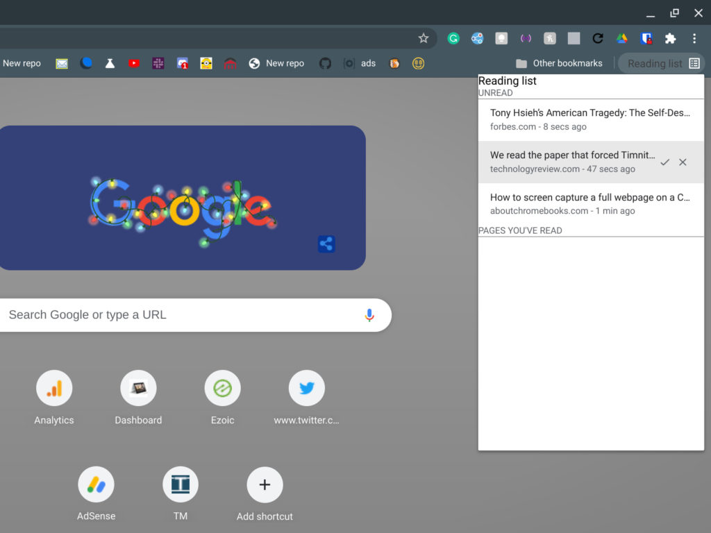

The Stable Channel of Chrome OS 87 started rolling out to Chromebooks this week. Along with official new functionality, some of the experimental ones are also working for me. My [Acer Chromebook Spin 13](https://www.aboutchromebooks.com/news/acer-chromebook-spin-13-with-16-gb-ram-should-you-buy-one/) received the update this morning, where I was able to use the new "Read Later" option, for example. [Google's official announcement for Chrome OS 87](https://chromereleases.googleblog.com/2020/12/stable-channel-update-for-chrome-os.html) doesn't share much detail on what's in the software update, but here is [a list of the fixed bugs](https://bugs.chromium.org/p/chromium/issues/list?sort=&groupby=&colspec=ID%20Pri%20M%20Stars%20ReleaseBlock%20Cr%20Status%20Owner%20Summary%20OS%20Modified&x=m&y=releaseblock&cells=tiles&q=os%3Dchrome%20M%3D87%20status%3DFixed&can=1).

## Read later (offline) is available as an experiment

The Google support forum says that [Tab Search is now available](https://www.aboutchromebooks.com/news/chrome-os-86-bringing-tab-search-to-chromebooks-and-its-awesome/) but I actually don't see it when the experimental `chrome://#enable-tab-search` flag is set to default. That seems odd to me. Regardless, it's easy to enable at that URL.

When enabled, I see a down arrow to the right of the rightmost tab in your browser. Clicking that shows my open tabs or lets me enter a search term in the text box to find a tab. Note that [9to5 Google is reporting that the user interface is, or will be, different](https://9to5google.com/2020/12/04/chrome-os-87/). They show a small circular icon option for Tab Search, likely from a Dev or Beta channel version. So when fully implemented, that could be the interface

## Bluetooth battery levels are _supposed_ to be showing

Also in the release announcement from Google support is that Chrome OS 87 shows the battery levels of Bluetooth connected devices. Again, the support forum says this is an available feature but with the chrome://flags/#show-bluetooth-device-battery flag showing as Default, I can't see the battery status. I even enabled the flag and restarted but no luck. Perhaps this is working on some devices and not others.

## More wallpapers, including some that were drawn on a Chromebook

Earlier in the week, Google announced that many [new Chrome OS wallpapers would be available](https://blog.google/products/chromebooks/whats-new-chrome-os/dec2020/). That in itself isn't too impressive. Some of these, however, were hand-drawn on a Chromebook using the Canvas app and that is impressive. Well, at least to me.

Here's a peek at how these were drawn:

https://youtu.be/83qmWW9pbFU

## Improvements to the Chrome OS photo editor

There aren't a ton of changes to the native Chrome OS photo editor, but it definitely looks more modern. The old one reminded me of 2010 and was showing its age. Now, in Chrome OS 87 opening an image file on your Chromebook shows a nicer user interface with improvements to the crop, rescaling and lighting features.

Oh, and [if you want to edit videos on your Chromebook, you might want to check out Clipchamp](https://clipchamp.com/en/), which Google highlighted this week in a blog post. It's an online video editing service that you use right in your browser and seems to offer a solid set of basic features. You can try it for free but bear in mind that Clipchamp is a paid service. Costs range from $5 to $20 per month, depending on the output resolution you need. The free Basic plan for example only exports video at 480p.

## You can save and read web pages later

Google didn't mention this feature, likely because it definitely is an experimental one at the moment. By enabling the flag at `chrome://flags/#read-later` and enabling it, I was able to save web pages to a new Read Later panel. When enabled and clicking the bookmarks star, you can save a page as a bookmark or to the new Read Later option.

To view pages later, just open a new tab page and look for the Read Later button to the right side of the Bookmarks bar. Click on any of those saved pages and it will open.

Reading a page will move the saved article to the "Pages you've read" section but not delete it. For that, you actually have to click the "x" check mark. Note that you can't read pages offline. At least not yet; I'm hoping that's an added feature while this is still in the works. And a little nicer formatting with some CSS would be appreciated too!

I know many, including myself, typically save pages to Google Keep or some third-party option such as Instapaper or Pocket, but I'm all for native functionality when it's a reasonably good option.

## Odd and ends you should know about Chrome OS 87

Here's a roundup of some other interesting changes in this release:

- This is the last version of Chrome OS to officially support the Adobe Flash Player. I doubt many of you will be affected
- This is the last version of Chrome OS to officially support Google Cloud Print. I know some of you aren't happy about that.
- Chrome OS 87 limits the power consumption of background tabs for some users. A widespread rollout arrives in Chrome OS 88.
- The Chrome PDF viewer is updated
- Some users will see the new Chrome Actions feature in Chrome OS 87 with more to follow with the next release.
- The Save to Drive feature has been expanded upon. You can now rename the file or save the file to a specified Google Drive folder location.
- When using Alt+Tab to switch between windows, you can now select a window with your mouse, touch screen, or stylus.

I'll keep digging around to see what else is new or improved in the Stable Channel of Chrome OS 87. Don't hesitate to share any findings you have once you receive the update; remember, Chrome OS rolls out in waves, so if you don't see the update available, it should show up in the next few days.
