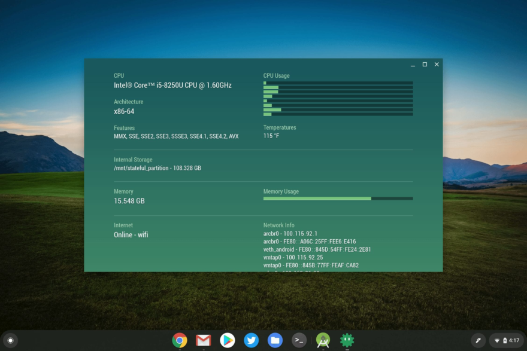
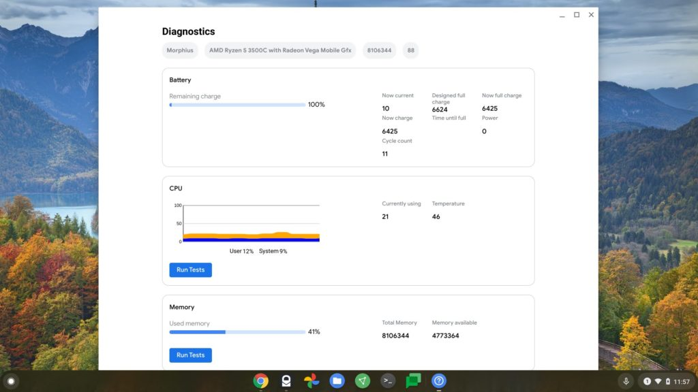

My week of featuring new, and often experimental, features in Chrome OS 88 continues, showing how to view your Chromebook's usage of memory, CPU, and battery. This follows earlier posts explaining the [new screen recording](https://www.aboutchromebooks.com/news/how-to-enable-the-experimental-screen-recording-function-on-your-chromebook-with-chrome-os-88/) and [Google Nest display-like screensaver features](https://www.aboutchromebooks.com/news/how-to-turn-your-chromebook-screen-saver-into-a-google-nest-display-of-sorts-with-chrome-os-88/).

Before I show how to use the new device diagnostics feature, I should note that it is experimental and still a work in progress.

If you use the [Cog System Info Viewer extension](https://chrome.google.com/webstore/detail/cog-system-info-viewer/difcjdggkffcfgcfconafogflmmaadco?hl=en), like I do, for monitoring device performance, you might not want to remove it just yet. And if your Chromebook doesn't support Chrome OS 88, Cog is a great tool that you can use to see system resource usage.

Cog System File Info

Assuming you're not in that latter category, simply browse to [`chrome://flags#`diagnostics`-app`](chrome://flags#diganostics-app). Next, enable the experimental feature. You'll need to restart your Chromebook browser when prompted as well.

After that, just look for the Diagnostics app in your Launcher and fire it up!

You'll see resource information on your CPU, memory usage, and battery information, including how many battery cycles your device has gone through.

That's often a handy bit of information when selling a Chromebook as potential buyers want to know how much longevity the battery still has; after a certain number of cycles, the battery will start holding less of a charge.

You'll also notice some system information at the top of the Diagnostics app, such as the internal firmware name for your device.

You can also see the CPU name, the amount of memory, and the version of Chrome OS. You can find that information from other places too (`[chrome://system](chrome://system)` comes to mind) but having this information front and center is useful.

Note that you can run CPU and memory tests here as well. I ran them on the [Lenovo ThinkPad C13 Yoga Chromebook](https://www.aboutchromebooks.com/news/lenovo-thinkpad-c13-yoga-chromebook-first-look/), but there wasn't much useful output. That could change as Google continues to build out this Diagnostics app for Chromebooks over the coming months.
