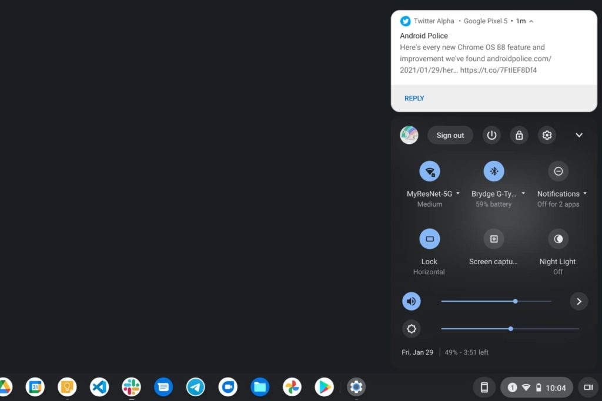

We've known that [Google was working on a Chromebook solution similar to Microsoft's Your Phone](https://www.aboutchromebooks.com/news/heres-what-phone-hub-for-chromebooks-looks-like-in-chrome-os-87/) for some time. After hiding behind an experimental flag on Chromebooks, [Chrome OS 89 enables the Phone Hub by default](https://www.thurrott.com/mobile/chrome-os/247230/phone-hub-for-chrome-os-is-now-available-for-testing).

Theoretically, you can try this on Chrome OS 88 but you'll need to enable `chrome://flags#enable-phone-hub` and restart your browser. Additionally, it appears that Google is doing some limited testing for the Phone Hub. Even if the flag is enabled, you may not see the function. [According to Android Police](https://www.androidpolice.com/2021/02/02/phone-hub-for-chrome-os-is-slowly-rolling-out-to-beta-and-dev-channels/), using a beta version of Google Play Services may be the link here.

Image courtesy [Android Police](https://www.androidpolice.com/2021/02/02/phone-hub-for-chrome-os-is-slowly-rolling-out-to-beta-and-dev-channels/)

I'm running Chrome OS 89 on two devices right now and even though I have Google Play Services beta on my phone, I still can't see the setting.

Regardless, it's clear that we're heading towards at least a soft public launch of Phone Hub soon; likely with Chrome OS 89. Once set up, you'll be able to view Android notifications (seemingly limited to chat apps for the moment) and recent Chrome browser tabs.

Here's a shot of a Twitter notification to give you an idea of what to expect.

Image courtesy [Android Police](https://www.androidpolice.com/2021/02/02/phone-hub-for-chrome-os-is-slowly-rolling-out-to-beta-and-dev-channels/)

While this type of integration is welcome, I'm still wondering if Google can and will do more with Phone Hub.

Microsoft's Your Phone Android app allows full control of mobile apps, supports text copy and paste between Android and a PC, and also phone calls. That latter one sounds silly, but to be honest: I love this feature on Mac devices. When my iPhone rings, I can take the call from my MacBook Air, iPad or an Apple Watch. That's the type of integration I'd like to see Google add in to make the Android and Chrome OS ecosystem a little more cohesive.

As we wait for Chrome OS 89, I'll keep flipping switches and rebooting my Chromebooks to try and get the Phone Hub on my device. Once that happens, I'll share any firsthand experiences.
