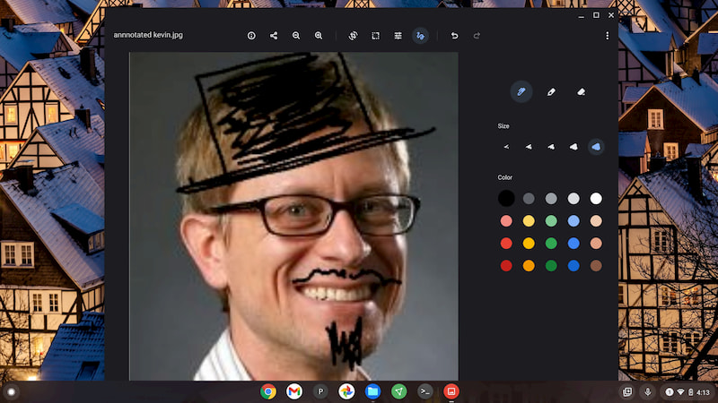
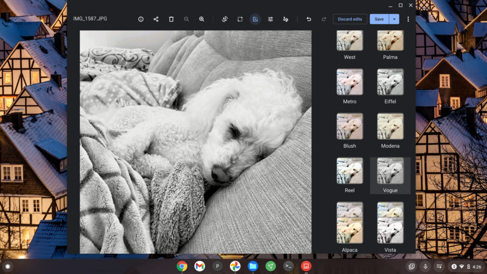
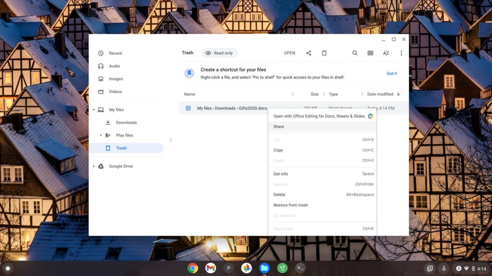

The latest Dev Channel release for Chrome OS 89 has a few nice features to improve the Chromebook experience. [Kent Duke over at Android Police noted a few of them with regards to the Media app](https://www.androidpolice.com/2021/01/04/the-chrome-os-media-app-will-soon-gain-annotation-tools-color-filters-and-exif-support/).

Image annotations, for example, are supported as are preset image filters similar to what you'd find in Google Photos or Instagram. I also see that that the Trash can for the Files app is working for file deletion and restoration.

Media annotations are likely best used with a pen-enabled device. However, a touchscreen or the trackpad can do the trick too as shown in the image below.

Yeah, I didn't have many photos to ink up, so I just made my headshot look a little more formal. ;) With the native annotation tool, you have several color and thickness choices.

The filter tool is what you'd expect if you've ever used one before. It is an experimental feature that you have to enable in the Media app: Click the three-dot menu, Experiments, and choose "enable colorFilter tool".

Here's an original image of my pal, Norm, followed by the filter options and output after choosing one.

I've also been waiting for the Trash can feature in the native Files app to work and it does in Chrome OS 89 currently. I was able to delete a file and then open the Trash can to see its contents. My deleted file was there, as was an option to restore it. I tested it and saw my file back in the My Downloads folder where it was originally.

Note that you'll need the current Dev Channel of Chrome OS 89 to try any of these features, which are hidden behind flags.

You'll want to enable `chrome://flags#media-app` and `chrome://flags#media-app-annotation` for the Media features, while `chrome://flags#files-trash` enables the working Trash function. Or you can wait for the Stable Channel release of Chrome OS 89, expected to start rolling out around March 9.
