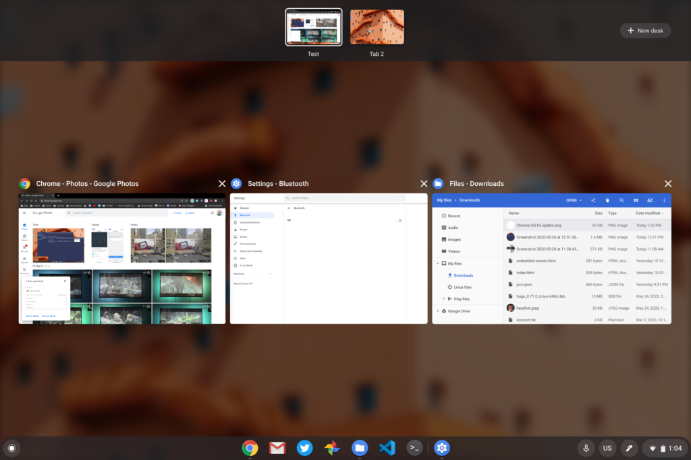

The productive Virtual Desks feature on Chromebooks is quickly maturing. After adding the ability to name and restore your configured workspaces in Chrome OS 83, [Chrome OS 89 will bring a very useful feature: Restoring your open tabs and browser sessions to the previously used Virtual Desk](https://chromium-review.googlesource.com/c/chromium/src/+/2572316).

A feature request for this functionality [was opened up more than a year ago](https://bugs.chromium.org/p/chromium/issues/detail?id=996999), where it basically languished in lieu of other Chrome OS priorities. Over the past six weeks, however, a slew of work was completed on the request to restore an active desk and windows in each desk.

Here's a video look at how the code currently works on a Chromebook after signing out of a session and signing back in:

To enable this, code was added to save open desk and window information to a Chromebook user's profile. In the case of a system crash or logging out of the Chromebook, the user profile information is used to restore the previous workspace configuration.

I haven't seen any code that clears the relevant user profile information. I'm assuming then that this could work after a reboot as well. It's possible that I've missed some code to prevent that, however.

From the first implementation of Virtual Desks on Chromebooks, there was much potential for a productivity boost. But it's taken some time to flesh out the functionality to really make it a compelling user interface tool.

The addition of [keyboard shortcuts](https://www.aboutchromebooks.com/news/chrome-os-78-will-bring-the-keyboard-shortcuts-to-virtual-desks-on-chromebooks/) and [virtual desk](https://www.aboutchromebooks.com/news/virtual-desks-for-chromebooks-swipe-gesture-to-switch-desktops-chrome-os-76-77/)  [naming](https://www.aboutchromebooks.com/news/chrome-os-83-stable-channel-arrives-what-you-need-to-know-release-notes/) have helped. And [the addition of 8 (or even 16) workspaces](https://www.aboutchromebooks.com/news/need-more-virtual-desks-on-your-chromebook-you-might-have-8-or-16-in-the-future/) will too for power users. Out of all these though, the ability to restore open windows into the desks they were last used may be the best yet. Particularly for people that use the same websites or apps on a regular basis and have them set up to run on specific virtual desks.

Note that there will be a `desks-restore` flag for this experimental feature, so if you're running Chrome OS 89 on the Canary or Dev Channel, you _might_ be able to try it out now.
