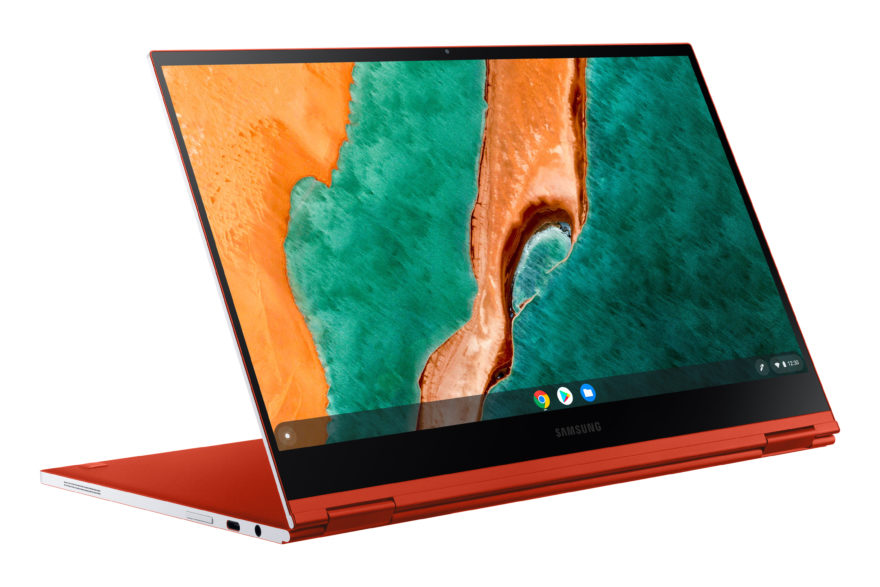

After [rolling out to most Chrome OS devices a few weeks ago](https://www.aboutchromebooks.com/news/chrome-os-90-stable-channel-for-chromebooks-arrives-what-you-need-to-know/), the latest Stable Channel update is here for the Chromebooks that have been waiting. While [Chrome OS 90 arrives late for some Chromebooks](https://www.reddit.com/r/chromeos/comments/nb2ca3/chromeos_90_for_remaining_platforms/), it brings Android 11 in the new containerized environment to them. There are still three Chromeboxes currently running on Chrome OS 89.

According to folks on Reddit, the Chrome OS 90 Stable Channel for those Chromebooks began on Wednesday evening. The Chromebooks that were waiting include the following models, all built on the "hatch" board:

- IdeaPad Flex 5i Chromebook (13", 5)
- HP Chromebook x360 14c
- HP Pro c640 Chromebook
- ASUS Chromebook Flip C436FA
- HP Elite c1030 Chromebook / HP Chromebook x360 13c
- Acer Chromebook 712 \[C871\]
- Acer Chromebook Spin 713 (CP713-2W)
- Samsung Galaxy Chromebook
- Samsung Galaxy Chromebook 2

So if you have one of these Chromebooks, the good news is that you can now update your system software, if you didn't yet receive it.

However, even though these are the first Chrome OS devices to get Android 11 and you likely want to see the impact of that, there appears to be bad news. Android app performance seems like a step backward based on [some comments from users who have tried Android 11](https://www.reddit.com/r/chromeos/comments/naxuwx/android_11/) on their newly updated Chromebook.

Here's a sampling:

> Is a mess so far - loads of issues. Apps not loading, Play Store crashing, Closing apps from Overview in Tablet Mode crashes Android, My Flex 5 has been fans blazing all the time since update, despite low numbers of CPU processes. It's a bad one so far for me across Spin 713 and Flex 5 i3 model. Remove Play store in Setting and everything returns to normal.

> Performance is utterly terrible, sometimes it refuses to boot. I'm waiting for it to completely break and require a powerwash.

>  Just updated my 713 as well but now my Android apps won't launch

That's not a good first impression of Android 11 apps running in the new ARCVM environment.

Some folks appear to have resolved many of their issues simply by turning the Google Play Store off on their Chromebook and then re-enabling it. I'd probably do a reboot in the middle of that process, but that's just me. Regardless, if you're impacted by this update, you may want to try that.

If that does work, it suggests that Android 11 issues could be due to upgrading or migrating from the older Android version that all other Chromebooks are using.

And this situation underscores why I've previously suggested that Chromebook users, at least on the consumer side, [have control over their software updates](https://www.aboutchromebooks.com/news/its-time-for-chromebook-users-to-have-more-control-over-chrome-os-automatic-updates/) to a degree. Maybe you want to pass on this specific version of Chrome OS 90 and wait for some fixes. But you can't as it stands today.

We'll have to see if and how Google responds to any of these issues; presumably impacted users will file bugs to catch the attention of Chrome OS developers. For the moment, I actually [don't see any open issues in the Chromium bug tracker when searching for 'ARCVM'](https://bugs.chromium.org/p/chromium/issues/list?q=arcvm&can=2&sort=-opened).
