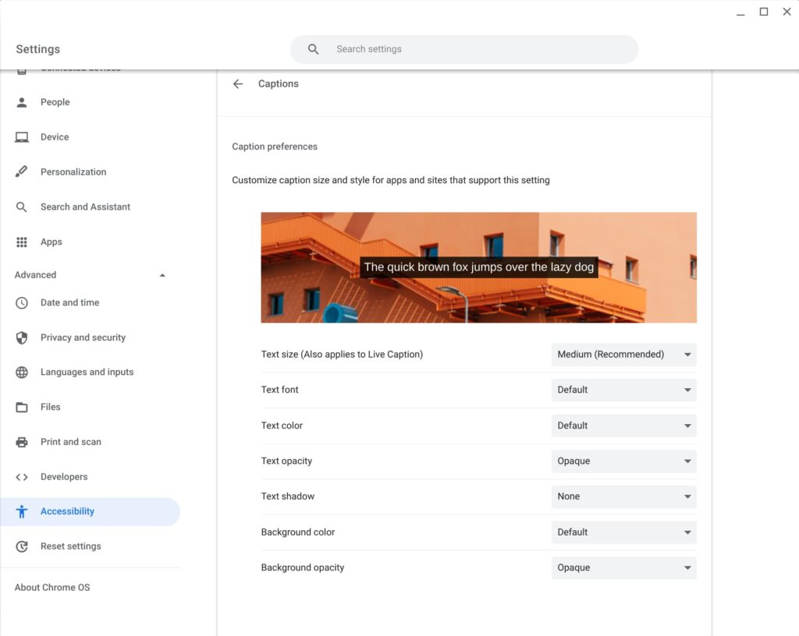
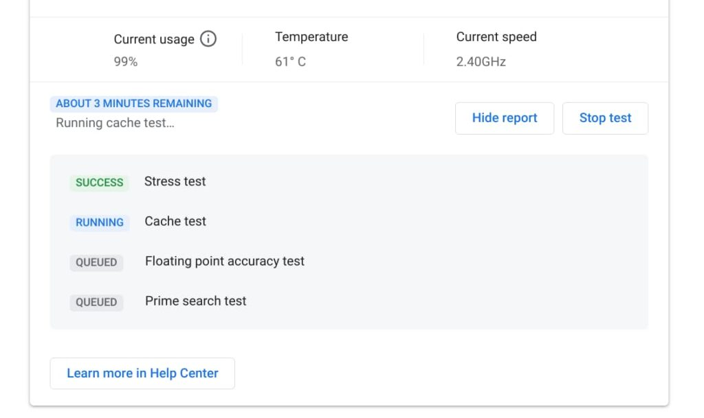
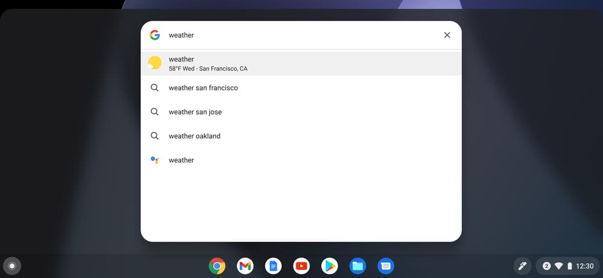
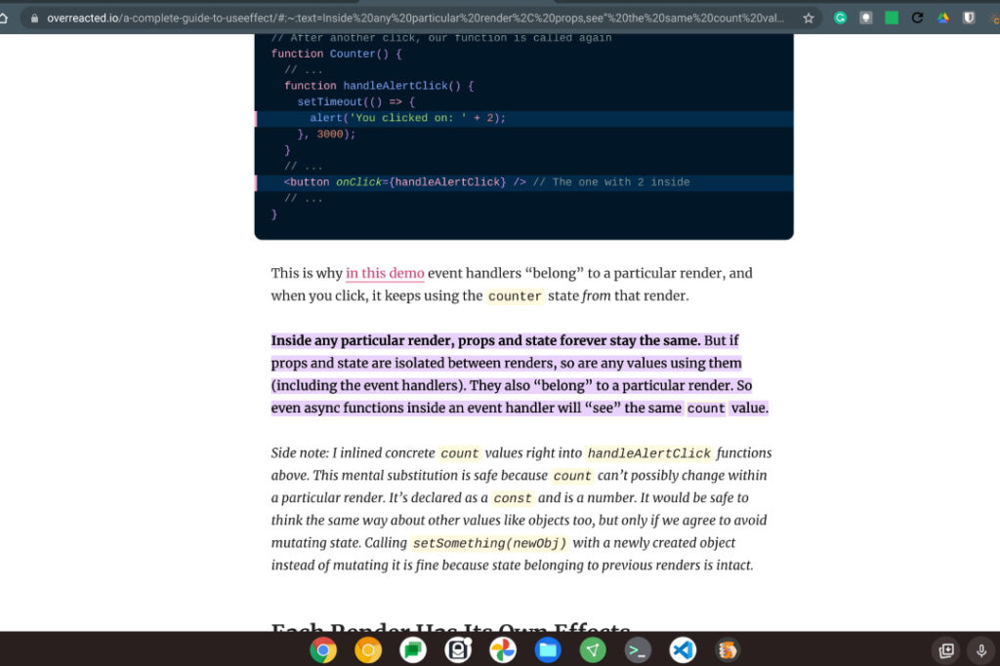
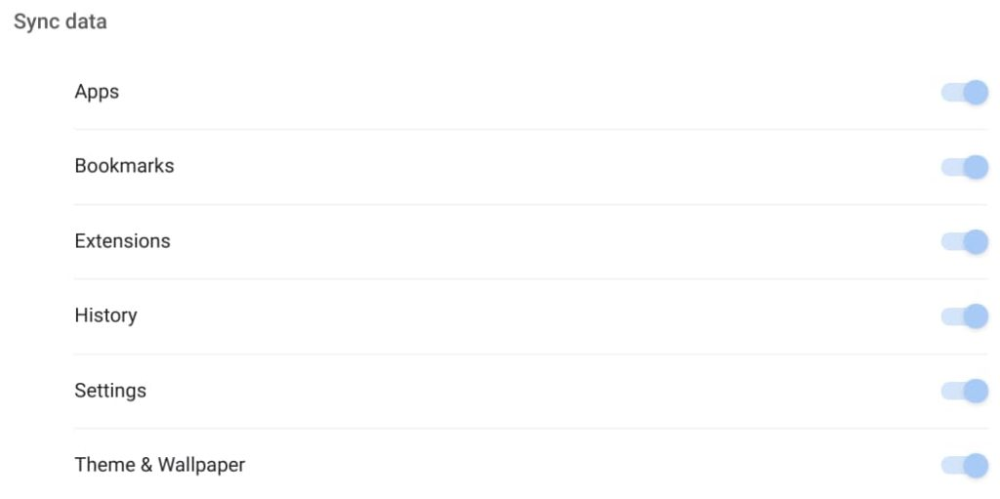

[Google today released the Chrome OS 90 Stable Channel platform for Chromebooks](https://blog.google/products/chromebooks/chromebook-gets-a-little-more-helpful/) with several new official features.

My own Chromebook received the update already but you may have to wait a bit if it doesn't appear for you. Google typically rolls out new Chrome OS software over a few days.

Once your Chromebook is updated, you'll notice four new features that Google pointed out in a blog post this afternoon. And of course, I'll cover [some of the experimental features](https://www.aboutchromebooks.com/tag/chrome-os-90/) you can try too.

## Live Captions for video

Announced last month for the Chrome browser, the new Live Captions feature comes to Chromebooks. When enabled, you'll see on-screen text from all media that includes audio.

You'll find the setting to enable and configure Live Captions in the Chrome OS settings under Advanced, Accessibility, and Captions (which is under the Audio and Captions menu):

## Chromebook Diagnostics

Regular readers will already know about the [new Diagnostics tool in Chrome OS 90](https://www.aboutchromebooks.com/news/check-out-the-new-chromebook-diagnostics-app-in-chrome-os-89/), as I reported on its earlier stages in Chrome OS 89 last month.

While it was a work in progress then, it appears to be polished up now.

Indeed, when I was running some of the battery, CPU, and memory tests last month, they weren't fully functional. I've run them again with Chrome OS 90 and they completed successfully.

Previously, you had to enable an experimental flag to get access to the Diagnostics app. That's no longer needed and you should find the new app in your Chrome OS app launcher.

## More information from the Launcher in Chrome OS 90

Google is also making it easier to get useful information quicker with Chrome OS 90. Now you can search for things such as the weather in the Launcher search bar and you'll see relevant data.

> Just tap the Everything Button and type “weather” or your math question into the search bar, and the result will automatically pop up. So you’ll quickly find out whether you need a sweater for your mid-afternoon walk, or what 42 times 96 is. There’s no need to open another Chrome browser tab or app to quickly get the answers you need.

I should note that when I type weather, I actually get web and app suggestions, but that could be due to some experimental flags I have enabled or disabled. Hopefully, you get the information you're looking for.

## Improved Scanning support

If your printer doubles a scanner, you can now use it with your Chromebook to scan pages or images.

My printer is... just a printer. So I haven't tested this feature. If you have a scanner, simply look for the new Scan app in your Chromebook app Launcher and give it a go.

## Other bits in the Chrome OS 90 Stable Channel for Chromebooks

Earlier this week, I explained [how to try the new (and useful!) Copy Link to Text option in Chrome OS 90](https://www.aboutchromebooks.com/news/how-to-use-the-copy-link-to-text-option-in-chrome-os-90/).

You will have to enable the experimental flag for it but once you do, you can highlight text on any web page and create a link to the page. That link not only opens the page but takes you directly to the highlighted text and shown below:

With Chrome OS 90, you can still disable the Tote feature that provides quick access to recently used, or pinned, files and folders. [Here's how to do that if you'd rather not use Tote](https://www.aboutchromebooks.com/news/dont-like-the-new-tote-feature-in-chrome-os-89-heres-how-to-disable-it/).

I believe this flag will expire within a Chrome OS release or two, meaning it will always be enabled at some point in the future. My hope is that Google considers adding an option in the Chrome OS Settings to enable or disable Tote for those who prefer not to use or see it.

If you use multiple Chromebooks, or computers with the Chrome browser, Chrome OS 90 adds a new Theme & Wallpaper option in the Sync settings.

Once you have either of these to your liking with a custom theme or wallpaper image and enable them to sync, you'll see them on all of your devices.

I actually like to mix things up on a daily basis, but that's just me.

I haven't seen many other new experimental flags, but I've only given the list a quick once over.

If I find any additional ones of value, I'll update the post to reflect the additional information. In the meantime, if you notice any that I might have missed so far, drop a comment and share with the group!
