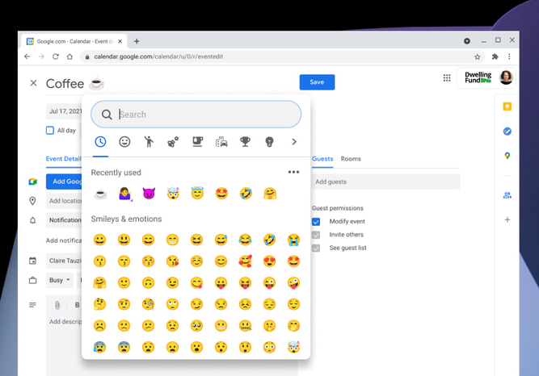

After [a few hiccups with Chrome OS 91](https://www.aboutchromebooks.com/news/lessons-to-learn-from-the-chrome-os-91-stable-update-bug-situations/) last month, [Google released the Chrome OS 92 Stable Channel update](https://blog.google/products/chromebooks/express-yourself-and-connect-with-others-on-chromebooks/) on Monday. As is typical, not every Chromebook will receive the software update at the same time. So while you may not see it available on your Chromebook or other Chrome OS device today, it will likely appear this week. Lucky for me, [my 16 GB Acer Chromebook Spin 13](https://www.aboutchromebooks.com/news/acer-chromebook-spin-13-with-16-gb-ram-should-you-buy-one/) already received it.

Google has an official blog post that highlights some of the updated features and fixes in Chrome OS 92 Stable, but as always, there's more in the software. I'll highlight the official updates and cover some of the others that may not have been mentioned.

## Google Meet improvement and pre-installation

Chrome OS 92 Stable brings Google Meet along for the ride as the video conference application is now installed by default. So if you didn't have Meet before, you will.

That might irritate some but I understand Google's approach here. It wants to create and offer all of the online tools you might need for a full experience.

However, I noticed that Meet actually didn't get installed on my Chromebook with the update. So... there's that.

Additionally, Google Meet has been improved to offer new virtual backgrounds and better call quality. And the app is was made available [as a PWA, or progressive web app, last week](https://workspaceupdates.googleblog.com/2021/07/use-new-google-meet-web-app-for-better.html). This will become more important [with Chrome OS 93 as PWAs can be registered to handle URL links; when clicking a Meet link in your browser](https://blog.chromium.org/2021/07/chrome-93-multi-screen-window-placement.html), the Google Meet PWA app will open in lieu of a new browser tab.

## New keyboard shortcuts including one for emoji

Upon updating my Chromebook to the Chrome OS 92 Stable Channel, I saw a notification about new keyboard shortcuts. I haven't looked at them all but one is for the improved emoji picker. Just click the new keyboard shortcut (Search or Launcher key + Shift + Space) to bring up the compact emoji picker.

You'll see recently used emojis and can search for any others in just about any text field on your Chromebook. ?

## eSIM support but only for two devices right now

It's nice to see eSIM support in Chrome OS but the reality is kind of meh. This feature allows you to change carriers, assuming you have a data plan, via an eSIM in your Chromebook. But as I outlined not long ago, [there aren't currently a ton of great Chromebook options with LTE](https://www.aboutchromebooks.com/news/want-an-lte-chromebook-here-are-your-current-options/), let alone LTE and eSIMs.

However, Google did give a shoutout to the [Acer Chromebook Spin 513](https://www.aboutchromebooks.com/news/acer-chromebook-spin-513-review-roundup-a-relatively-solid-entry-level-laptop/) and Acer Chromebook 511, which support eSIMs. Maybe this lack of support is why we can't yet purchase the Spin 513 with LTE? If that's the case, I'm sure we'll hear something about availability shortly from Acer.

## Other features (so far) that Google didn't mention in its blog post

I haven't gone through [the full changelog for this release](https://chromium.googlesource.com/chromium/src/+log/91.0.4472.167..92.0.4515.130?pretty=fuller&n=10000) so there's sure to be much more in this update.

Here's a brief overview of some other features in the Chrome OS 92 Stable release, many of which people on the Dev and Beta channels have been enjoying for at least six weeks:

- Android and Linux apps can be assigned to a specific Virtual Desk or all desks.
- External pan-tilt-zoom cameras have PTZ support in the camera app.
- You can now use Dictation for continuous speech-to-text.
- Tote will show recently installed Android apps and saved PDFs from the browser. (But I still want to [disable Tote](https://www.aboutchromebooks.com/news/dont-like-the-new-tote-feature-in-chrome-os-89-heres-how-to-disable-it/)!)
- [Fix for a 2019 bug](https://bugs.chromium.org/p/chromium/issues/detail?id=1028596) that broke Virtual Desk keyboard shortcuts on non-US keyboard layouts.

## New flags to try

- A new experimental flag to show the "new tab" button in a tab strip instead of the toolbar: `chrome://flags#webui-tab-strip-ntb-in-tab-strip`
- A new experimental flag to support "sub apps" or "multi apps". This will enable installed PWAs to create shortcuts by installing their sub apps: `chrome://flags#enable-desktop-pwas-sub-apps`
- A new experimental flag to enable the playback speed button on the media controls: `chrome://flags#playback-speed-button`
- A new experimental flag to enable a full restore of tabs and apps from the last session: `chrome://flags#full-restore`. Here's [a full post on how to set up and use this feature in detail](https://www.aboutchromebooks.com/news/how-to-add-full-restore-on-a-chromebook-to-reopen-all-apps-in-chrome-os-92/).

As I go through the super long list of changes and discover what else is in there, I'll add more of them here. Don't hesitate to comment with any new features or functions you find!

_Update: Added a new feature/bug fix to the list at 1:17 pm EDT, August 3, 2021_  
_Update: Added new experimental feature flags at 10 pm EDT, August 3, 2021_  
_Update: Added new experimental feature flags at 1:30 pm EDT, August 12, 2021_
