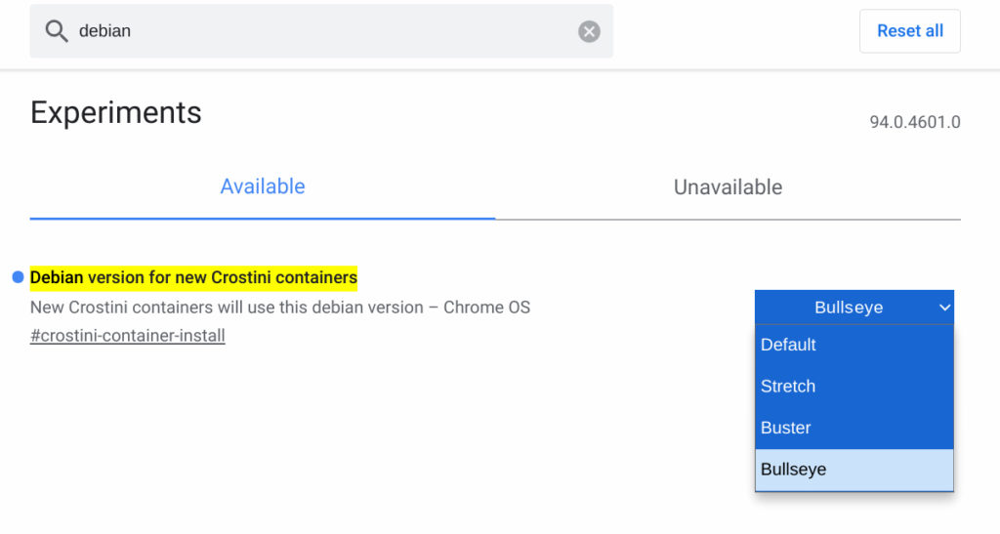
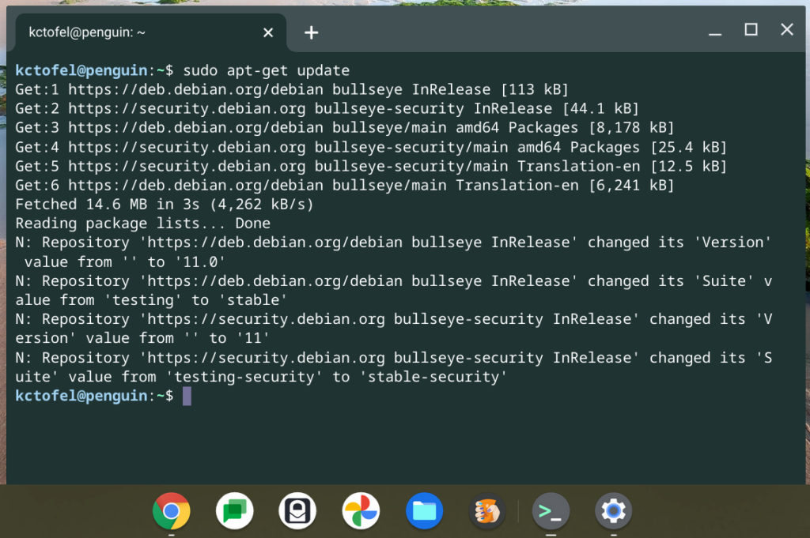

Did you hear? There's a new major update of a desktop operating system now available. No, it's not Windows, macOS, or even Chrome OS. It's [Debian Bullseye, which is version 11 of the popular Linux platform](https://www.debian.org/News/2021/20210814). And Chrome OS 94 brings Debian Bullseye to Linux on Chromebooks.

The upgrade of the Linux container on Chromebooks is still a work in progress as there are some changes the Chromium development team has yet to make. You can [read about them in this bug report](https://bugs.chromium.org/p/chromium/issues/detail?id=1217902#c14). But if you have a Chromebook running the Dev Channel of Chrome OS 94 as I do, you can install and use Debian Bullseye on your Chromebook.

On the [Stable Channel of Chrome OS, currently, version 92](https://www.aboutchromebooks.com/news/chrome-os-92-stable-update-arrives-heres-what-you-need-to-know/), all new Linux containers on Chromebook use Debian 10, or the Buster version. Previously, Chromebooks used Stretch, which is Debian 9.

With the Dev Channel of Chrome OS 94, there's an option to choose your Debian version from among the three. You'll have to navigate to `chrome://flags#crostini-container-install` where you can make that choice:

I chose Bullseye and deleted my existing Linux container for testing. Then, following the standard method to enable Linux support in the Chrome OS Settings, I created a new Linux container. Sure enough, it's Debian Bullseye.

I have no plans to rely on this Bullseye container for what I'd call "production work" or for [my Computer Science classes](https://www.aboutchromebooks.com/news/linux-on-chromebooks-just-might-get-me-through-a-masters-in-computer-science/). Nor would I recommend you do so. As I mentioned, there are some changes that need to be made for full Chrome OS support.

Regardless, Debian Bullseye does bring new behind-the-scenes changes including exFAT filesystem support and improved driverless printer and scanning support to name a few. The [full release notes for Debian Bullseye can be found here](https://www.debian.org/releases/bullseye/amd64/release-notes/index.en.html).
