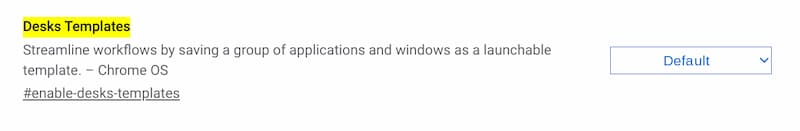
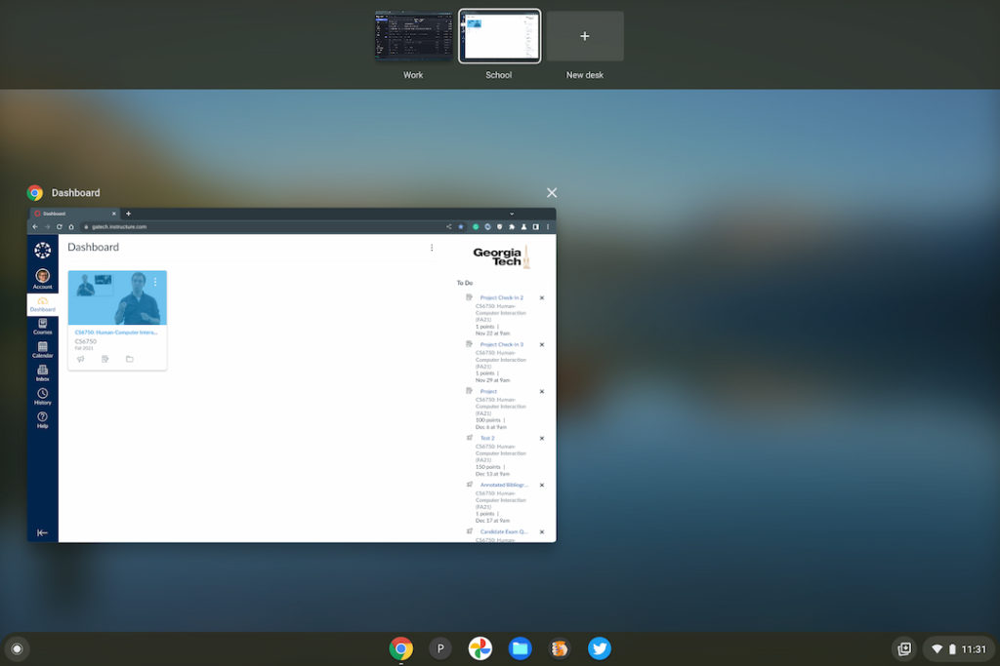
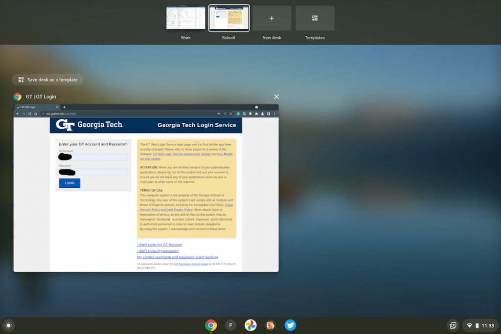
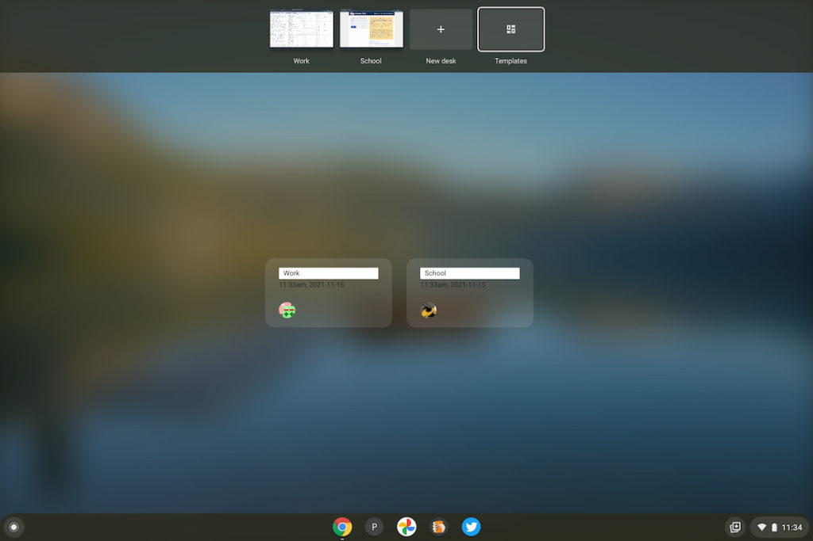

Earlier this month, Chrome Story reported a [new Chrome OS experimental flag would add custom virtual desk templates](https://www.chromestory.com/2021/11/desks-templates/). The idea is for Chromebook users to save [virtual desk workspaces](https://www.aboutchromebooks.com/tag/virtual-desks/) with apps and browser tabs of their choosing. This saves time by letting users open the saved virtual desk template, which restores the saved apps and tabs. Today I found that the custom virtual desk templates feature has found its way into the Dev Channel of Chrome OS 97.

Here's an early look to show how to use custom virtual desk templates, although if you're on Chrome OS 97, you can try it yourself. You just need to enable the flag at `chrome://flags#enable-desks-templates` and restart your browser.

Without this flag enabled, here's what the current virtual desks interface looks like. In this example, I have a desk set up for "work" and a desk set up for "school".

After enabling the virtual desks templates flag and restarting my browser I set up the same two desks.

Here's what's changed:

Notice that there's a new "Templates" option at the top of the display when viewing all of the virtual desks? Clicking there shows all saved templates. There's also a "Save as Template" option when viewing any of the desks.

I saved both my Work and School templates to keep those worlds separate on my Chromebook. After doing so, clicking on the Templates icon when viewing virtual desks shows my two templates, where I can choose between them and open any or all of them. Each time I do that, Chrome OS will restore the saved template, which includes the open apps and browser tabs.

Although the feature is experimental and may change prior to the Stable Channel release of Chrome OS 97, I can already see the benefit. Instead of simply restoring tabs and apps from a prior session, I can preset specific apps and tabs to open on a virtual desk at any time. The template can be edited or renamed as well.

Given that we're currently waiting for Chrome OS 96 to roll out globally, I'd expect this change to arrive in late December for all Chromebooks.
