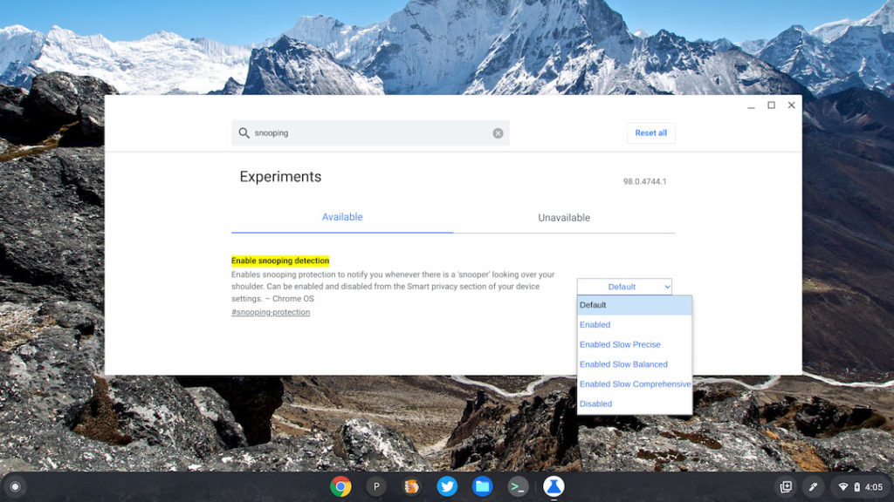
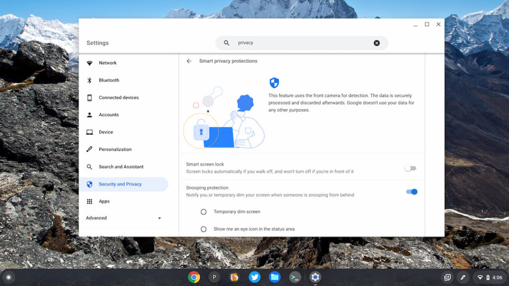

Back in September, we heard [reports from 9to5 Google of a new Chromebook privacy feature](https://9to5google.com/2021/09/03/google-human-presence-sensor-chromebook-face-unlock/) in the works. Not, it's [not the one I recently mentioned](https://www.aboutchromebooks.com/news/new-chromebook-privacy-feature-already-common-to-macos-and-windows-pcs-on-the-way/) that catches Chrome OS up to macOS and Windows. It's a _different_ one that those platforms don't currently have. Google is using sensors to detect if another person is reading your Chromebook screen behind your back. The newest version of Chrome OS 98, on the Dev Channel, adds this snooping detection to Chromebooks.

Of course, being an experimental feature, I had to manually enable it. For those of you on the Chrome OS 98 Dev Channel, head into your flags (now its own "app") and look for "Enable Snooping Detection."

You'll have a few different precision options to choose from when enabling this feature. Then restart your browser to apply the flag settings.

For now, I'm not 100% sure about the three "levels" of detection. I assume they use more or less computing power for accuracy and to reduce false positives.

Aside from turning on the snooping detection in this way, you'll also have new options in your Chrome OS Security and Privacy settings. Here's a look at your choices, as well as an explanation of the feature.

As it says, the feature will use your Chromebook's front camera to watch behind you. If it detects someone sneaking a peek at your display, you can either have the screen dim or show an eye-con (get it?) in your Chromebook's status area. At the moment, you can choose one or the other but not both.

I'll be curious as to how much this feature impacts general performance, particularly on entry-level Chromebooks. It's no small task to have a camera constantly monitoring something. And I wonder how many people will actually use the feature given that their Chromebook camera will always be watching.

Interestingly, the initial 9to5 Google report found significant evidence of a special HPC Sensor, or Human Presence Sensor, for this functionality. That suggested that only new Chromebooks with the HPC hardware would have this feature.

I enabled it on my 2018 Acer Chromebook Spin, which clearly doesn't have an HPC. So I'd anticipate that current Chromebook models will have snooping detection added once Chrome OS 98 rolls around.
