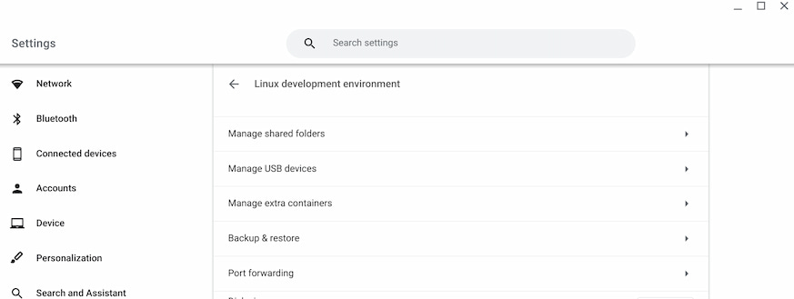
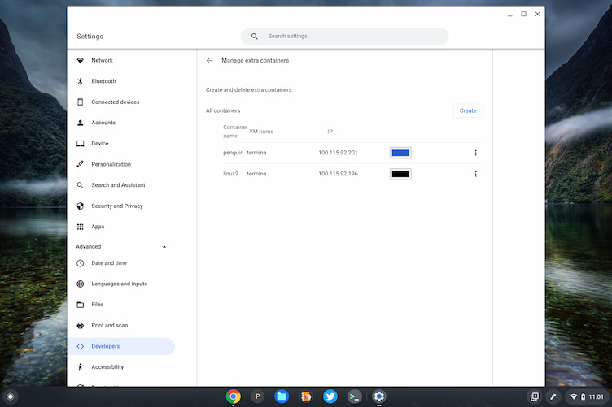
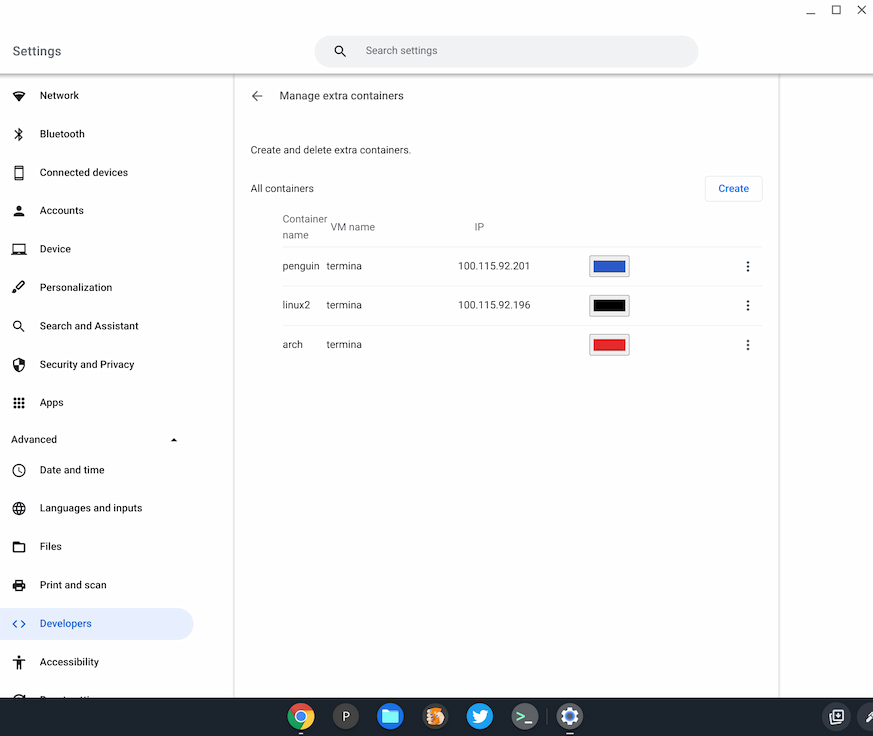
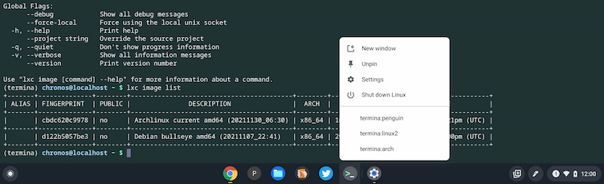

Earlier this month I reported that [Chrome OS](https://www.aboutchromebooks.com/news/youll-soon-be-able-to-easily-run-multiple-linux-containers-on-chromebooks/) was adding multiple container management to Chromebook. The last Dev Channel update has finally brought the first iteration of that feature and I do have it working. At the moment, however, I've only been able to add a second Linux container for Debian. Regardless, here's how Chrome OS 98 adds management of multiple Chromebook Linux containers.

For starters, I had to enable the following experimental flag in Chrome OS 98: `chrome://flags#crostini-multi-container` and restart my browser. After that, I saw the new "manage extra containers" option in my Linux settings:

Choosing this option brought me to the following screen, which initially had a single container, as expected. Here I could change the color of each one. I clicked the Create button, added a second Debian container, and left it the default color. The three-dot option offers ways to stop or delete a container.

I then tried to create a new container with a different Linux distribution. There are options to configure an image server address, but I wasn't able to get those working. However, I did [tinker around in a crosh terminal to get an Arch Linux image](https://wiki.archlinux.org/title/Chrome_OS_devices/Crostini#Replacing_the_default_Debian_Linux_container_with_Arch_Linux), which appears installed. Unfortunately, it won't yet start.

Regardless, by right-clicking my Terminal app, you can see that it can be started with any working installed Linux images. That gives you some sense of how to interact with each individual Linux instance on a Chromebook.

It could be that I'm not Linux-y enough to get some other distro working with the new container management feature. So I'll keep plugging away. And I'm open to suggestions from readers that are smarter than me!

For now, I like what I see. While most Chromebook users won't want or need multiple Linux containers, it can be handy for folks who want to use different flavors of Linux to get work done.
