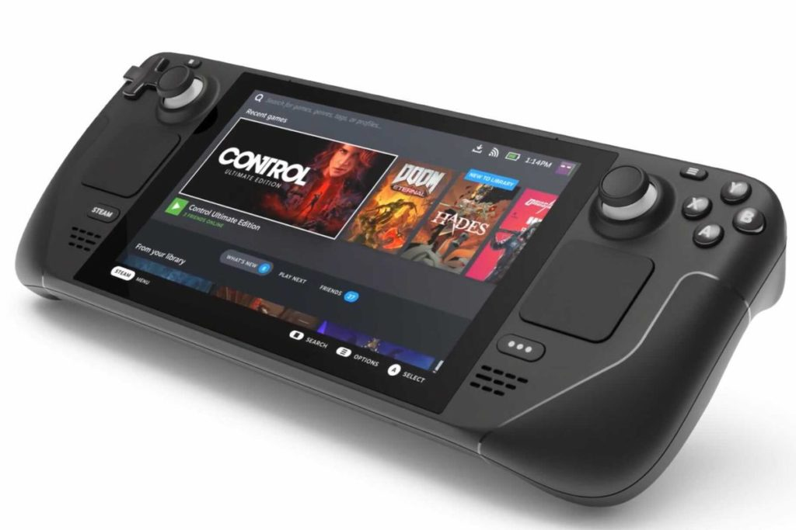

The old ["Chromebooks are just a browser" myth](https://www.aboutchromebooks.com/news/chromebook-myths-continue-because-of-articles-like-this/) continues to die a slow death. After adding Android and Linux app support, the next big advancement for Google's modern desktop platform is PC gaming. And I don't mean PC game streaming, although that's already available [via Stadia](https://www.aboutchromebooks.com/news/google-stadia-gaming-chromebooks-november-release-pricing-chrome-os-preorder/) and [Nvidia's GeForce Now](https://www.aboutchromebooks.com/news/steam-game-sync-on-geforce-now-for-chromebooks-may-make-it-a-better-option-than-stadia/). I mean a dedicated Linux container that locally adds Steam gaming on Chromebooks.

Google has been working on this project, known as Borealis, for at least a year at this point. And [a new Chromium code commit found by Android Police](https://www.androidpolice.com/official-steam-for-chromebooks-support-could-launch-this-month/) suggests that Chrome OS 98 will show off the first glimpse of Steam gaming on Chromebooks through some experimental flags.

Based on the code, it appears that like Chrome OS itself, Borealis will have its own beta version. That suggests to me that it will also have a stable version as well, but I could be wrong. I could see value in having two versions so Google can get some field testing data on the beta version while having a usable method too. For now, the experimental flag will be `chrome://flags#borealis-linux-mode`. It's not yet available in the Chrome OS 98 Dev Channel that I run.

One question I have is on the implementation side.

Given that Valve has created Steam OS, which runs on Linux, for its Steam Deck handheld, will this Linux container be the same thing? In a way, I hope so, and not just because I reserved a [Steam Deck](https://www.steamdeck.com/en/). But rather, it would provide a consistent interface and experience across devices.

And another, more important question is, how will Steam gaming on Chromebooks run based on currently available hardware?

The newest Intel Core processors should be fine for the CPU side. Integrated graphics, though? That's a constraint.

Note that the Steam Deck is using a custom AMD APU, which includes a Ryzen processor and a dedicated GPU. The GPU won't rival the latest Nvidia and AMD graphics cards but based on game demos, it's up to the task for 720p gaming with reasonable frame rates on most games. And I suspect that Steam gaming on Chromebooks will top out at 720p on pre-2020 devices.

Still, this is exciting news for Chromebook owners that are also PC gamers. And another reason that the "Chromebooks are just a browser" meme simply isn't true and hasn't been for years.
