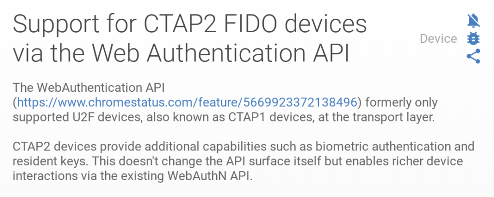

Lately, I've been keeping on eye on what Google is planning for version 69 of Chrome OS and the Chrome browser. A new feature is in the works to beef up two-factor authentication, or 2FA, that will [support CTAP2 devices and keys](https://www.chromestatus.com/feature/6288375388569600). CTAP is already supported, which is why you can use the Pixelbook power button or a USB Yubikey for authentication. CTAP2 builds on this with biometics and PIN support.

Here's shot of the feature addition:

The good part here, aside from more security, is that CTAP2 can fall back to CTAP if required. That's important since there are obviously large numbers of CTAP implementations out there and no CTAP2 devices on the market that I know of yet. Eventually, however, a transition to CTAP2 is likely.

I learned about some other benefits and got a better understanding of CTAP2 I from this list on [Hacker News](https://news.ycombinator.com/item?id=17026304):

- CTAP2 supports "user verification", such as PIN or biometric authentication locally on the hardware key. This enables using the key as both 1st and 2nd factor without need for a server-side password.
- CTAP2 supports storing the private key along with some metadata on the device, whereas U2F instead encrypts the private key and stores the ciphertext on the server. While the encryption approach allows for simpler hardware and an unlimited number of registrations, the local storage approach allows login without even having to type (or even have) a username. CTAP2 supports both.
- CTAP2 has an extensions framework in which an authentication vendor and server can cooperate to implement custom features without the browser having to understand them.
- CTAP2 - or at least the companion web API, Web Authentication - is compatible with more existing TPMs and such hardware. For example, it's theoretically possible that some Android phones could receive software upgrades that turn their fingerprint sensors into WebAuthn authenticators.

And for the truly curious, here's the [official Client to Authenticator Protocol spec](https://fidoalliance.org/specs/fido-v2.0-ps-20170927/fido-client-to-authenticator-protocol-v2.0-ps-20170927.html).

Although 2FA is generally meant for web authentication and not for specific computing devices, this could be used for securely logging in to a Chromebook without requiring any user input. In fact, if the Pixelbook power button was also a fingerprint reader, I'd personally [feel comfortable using it in this way](https://www.aboutchromebooks.com/news/yes-the-pixelbook-power-button-is-a-u2f-key-heres-why-i-wouldnt-use-it/).
