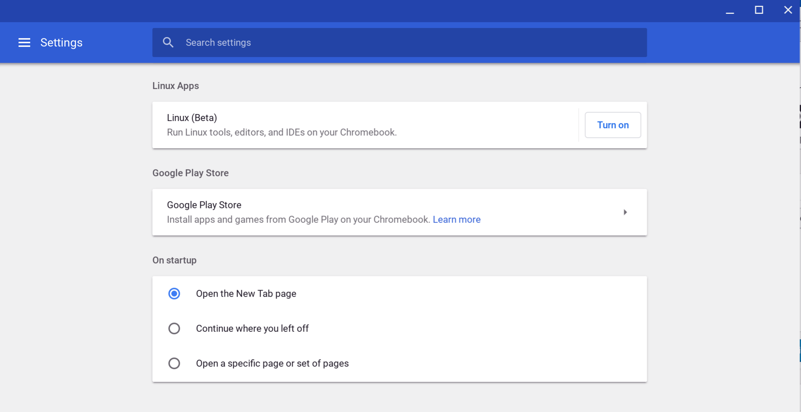

I thought we'd see the [Beta Channel of Chrome OS 69 arrive earlier this month](https://www.aboutchromebooks.com/news/project-crostini-linux-apps-chrome-os-beta-release-date/) but my timing was a little off. The [latest upgrade to the Beta Channel is now available](https://chromereleases.googleblog.com/2018/08/beta-channel-update-for-chrome-os_15.html), however, and finally moves support for Linux apps to the next stage of development; at least for some devices.

I'm sticking with the Dev Channel on my Pixelbook but I have a spare Toshiba Chromebook 2 that I switched to the Beta Channel to verify Linux app support in this version. But it's not there. However, [some Chrome OS device owners are seeing the feature on their Chromebooks](https://www.reddit.com/r/Crostini/comments/ate_for_chrome_os_version_69_not/?ut97khhn/beta_channel_updm_content=full_comments): The HP Chromebook X2 and HP Chromebook x360 11 G1 EE are two examples of devices with [Project Crostini](https://www.aboutchromebooks.com/tag/project-crostini) support on the Beta Channel, [as is the Samsung Chromebook Plus](https://www.reddit.com/r/chromeos/comments/97oftk/linux_apps_working_on_cb_69_beta_yay/).

To see if your device has Linux app support after upgrading to Beta Channel 69, check in Chrome OS Settings. If you do see the Linux (Beta) feature, click the "Turn on" button. Once you do, the Terminal app -- roughly 300 MB in size -- will be downloaded and installed to your Chromebook. At that point, you should be able to use the command line interface to install Linux packages, or you can try to [install downloaded .deb packages directly in the Chrome OS Files app](https://www.aboutchromebooks.com/news/how-to-install-debian-linux-packages-in-project-crostini-chrome-os-files-app/).

Originally the Linux support with Project Crostini was slated for Chrome OS 68 but the [feature was pushed back one full version](https://www.aboutchromebooks.com/news/project-crostini-linux-apps-chromebooks-release-date-chrome-69/). That's likely due to stability issues and other bugs that me and many others have seen when using the Dev Channel. However, many of those issues are resolved; or at least enough of them to get a wider testing audience.

Keep in mind that while you can install Linux apps within a container -- the default distro is Debian -- there are still some things not yet supported: USB access, GPU acceleration, and audio to name a few. But if you need a desktop text editor, coding environment, GIMP or some other app that's available on Linux, you're good to go.

I'll dig around to see what else has been added to this Beta Channel version although it may take some time: Most of the "new" features there are "old" in the Dev Channel I've been using.
