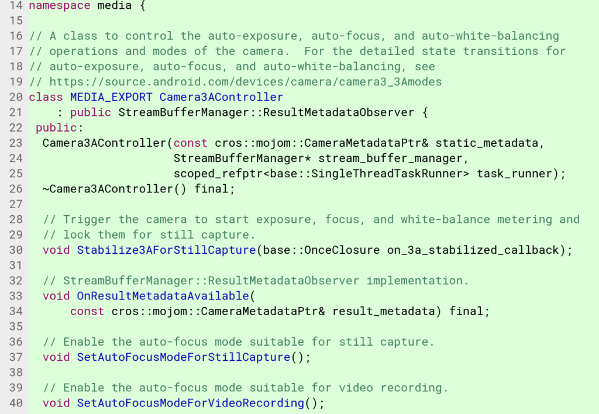

Last week, when [native video recording came to the Chrome OS camera app](https://www.aboutchromebooks.com/news/chromebooks-can-now-record-video-with-the-native-camera-app/), I was both happy and disappointed. It's great that a Chromebook or Chrome tablet can now capture video but the experience is very basic and it doesn't have the advanced features that many Android camera apps do. That may soon change with upcoming [automatic focus, exposure and white balance functionality](https://chromium-review.googlesource.com/c/chromium/src/+/1018641) being worked on, likely due to upcoming Chrome OS tablets, and their integrated rear-facing camera sensors, arriving as soon as this month.

I noticed this feature in Chromium OS commit logs where there's currently quite a bit of unit testing activity for the Chrome OS Camera app with particular mentions of known tablet and detachable devices.

Note that all of the advanced camera features currently apply to still images; video recording looks to be getting auto-focus only. for now. Keep in mind also that even if these newly coded features tested perfectly, it will take some time for them to migrate through the various Chrome OS channels.

That means it's unlikely the [Acer Chromebook Tab10](https://www.aboutchromebooks.com/podcast/acer-chromebook-tab-10-audio-thoughts-before-the-release-date/) -- expected to be available later this month -- will have these camera features at launch. Instead, they'll probably appear in a software update weeks after the device arrives on the market. Even the [HP Chromebook X2](https://www.aboutchromebooks.com/news/hp-chromebook-x2-arrives-as-the-first-detachable-chromebook-tablet/), which is expected to go on sale next month, isn't likely to have these camera features.

Still, this bodes well for a better camera experience on Chrome OS devices over time so that device owners won't have to download an Android camera app. The next logical step would be integrated tap-to-focus features, but we'll see. Bring on the Chrome OS tablets!
