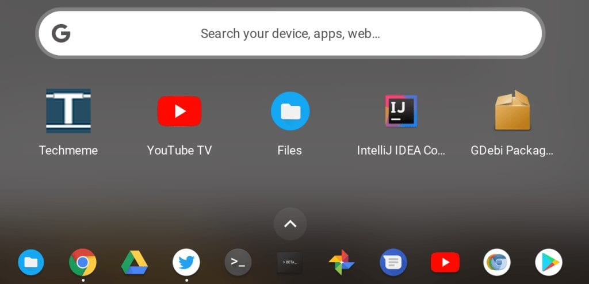

On Tuesday, the [Chrome OS Dev Channel was updated to version 69.0.3497.21](https://chromereleases.googleblog.com/2018/07/dev-channel-update-for-chrome-os_31.html), bringing with it some borrowed features from Android as well as additional stability to [Project Crostini](https://www.aboutchromebooks.com/tag/project-crostini) and Linux apps. The [full list of changes is available here](https://chromium.googlesource.com/chromium/src/+log/69.0.3497.14..69.0.3497.21?pretty=fuller&n=10000) but it's not like a change log that you'd typically see for most other software updates. Instead, it's a list -- a very long one, at that -- of the actual code modifications, which can often be cryptic.

Ideally, I'd like to see Google change that practice, however for now, this is what we get. Oh and we get to poke around in the software to see if we can find out what's new. So that's what I did and here's what I've seen so far both in the change log, other reports and in my own use of the updated software:

- **A new flag for the Continue Reading function:** When enabled, Chrome OS and Android behave a little like iOS and macOS with Apple's Handoff feature. It's just a portion of that functionality though, allowing you to start reading web page on either Android or Chrome OS and then moving to the other machine to pick up that same web page. I tested it last night by reading Techmeme on my phone. I then moved over to my Pixelbook and saw a link to that page in my Chrome OS Launcher. One tap and I was reading it on my Chromebook. The flag to enable is _#enable-continue-reading_ if you want to try it.
- **Android's Smart Text Selection**: This new function is also behind a flag, #smart-text-selection, and adds context when selecting text. That means if you highlight a map, phone number, or address, for example, you'll see app-related options to use alongside the typical "copy" and "select all" type of actions. Chrome OS is leveraging the intents function of Android to pair text formats with appropriate apps.
- **Project Crostini / Linux apps:** I don't see a mention of any changes here for Project Crostini, but I have noticed a little more stability. For example, before this update when I opened my Chrome OS Files app, my Linux files wouldn't always appear. I've tested and retested it several times with several reboots and now the function is working flawlessly for me. Note that some of Crostini is updatable manually by typing _chrome://components_ and tapping the appropriate Update button; if you see problems with Linux apps after updating the Dev Channel, be sure to check for a component update too.
- **Mounting .Zip archives in the Files app**: Somewhere along the line recently, this was broken but [as Keith Myers reports, it's now fixed](https://kmyers.me/blog/chromeos/chromeos-69-0-3497-21-rolling-out-to-users-in-the-dev-channel-with-subtle-changes/#more-2274). I verified it on my own machine and he's right. Yay!
- **Team Drive results will show in system searches**. I don't use any Team Drives, so I can't verify, but [the code description is pretty clear](https://chromium.googlesource.com/chromium/src/+/79780ac969015a8b937f106ec74baeb98ab208ba).
- **Picture-in-Picture fixes:** Most of these are behind the scenes so you may not see anything different when viewing a video in PiP mode. Picture in Picture used to require a [test or demo extension](https://www.aboutchromebooks.com/how-to/how-to-enable-picture-in-picture-on-a-chromebook/) but that's not the case now. Instead just right-click two times on a video source for the option. It works great for YouTube, but I'm disappointed I can't get it working in YouTube TV.
- **User interface changes for password saving:** This is preparation for additional changes for Smart Lock that [will be part of "Better Together"](https://www.aboutchromebooks.com/news/chromebook-android-messages-better-together/), also known as MultiDevice settings, that link an Android phone with a Chromebook.
- **Update messaging for rollbacks:** This is more for managed devices that need to go back to a prior Chrome OS release. When Chrome device admins force a rollback, [it's clear to users exactly what's happening](https://chromium.googlesource.com/chromium/src/+/e205a8d8bbc499e6af382cd172b168905f753445).

It's possible I missed some important updates, so chime in you've found anything. I follow the Dev Channel closely because all of the features added or tweaked eventually find their way to both the Beta and Stable channel, assuming they're relatively bug free, that is.
