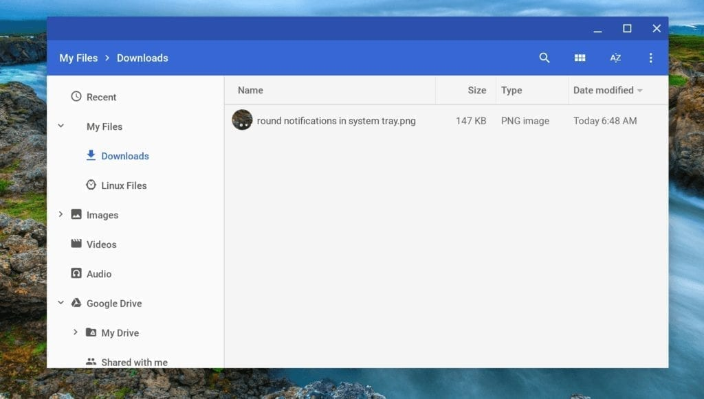
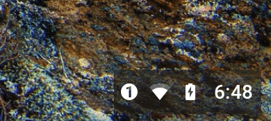

Adventurous users on Dev Channel version 69 have an update that's chock full of fixes and features waiting for them. [Google announced the software update on Thursday](https://chromereleases.googleblog.com/2018/07/dev-channel-update-for-chrome-os.html) and while I haven't gone through the entire change log -- it's a long one! -- some of the changes jumped out at me. Here are some of the items I've seen so far:

- [The new Files layout is present](https://www.aboutchromebooks.com/news/chrome-os-files-app-changing-again-to-better-integrate-local-android-and-linux-files/), moving Google Drive to the bottom of the tree and consolidating Android and Linux apps under the new "My Files" section.

- Linux apps that were crashing due to pop-up style function windows -- think "tool tips" in Integrated Development Environments -- are now stable. Note that [Project Crostini](https://www.aboutchromebooks.com/tag/project-crostini/) features can also be modified through the **cros-termina** component, so make sure yours is updated. To do this type _chrome://components_ in your browser bar and press the "check the update" button for **cros-termina**; you'll need at least version 10869.0.0 for the added stability.
- External monitors that were showing Chrome OS in a washed out mode now appear as they should.
- The notification tray has a slight visual change: The number of notifications is now shown in a small circular icon.

- There's a placeholder "learn more" link near the Linux Apps (beta) enablement choice is made: The help info is not live yet but will be on [this existing support page](https://support.google.com/chromebook?p=chromebook_linuxapps).
- [Picture-in-picture functionality](https://www.aboutchromebooks.com/news/picture-in-picture-on-chromebooks-chrome-browser/) has some behind the scenes improvements, although it's still not enabled by default; you'll need to enable it in _chrome://flags_.

That's what I've found so far, but if you see something additional in this new Chrome OS version, let me know in the comments.
