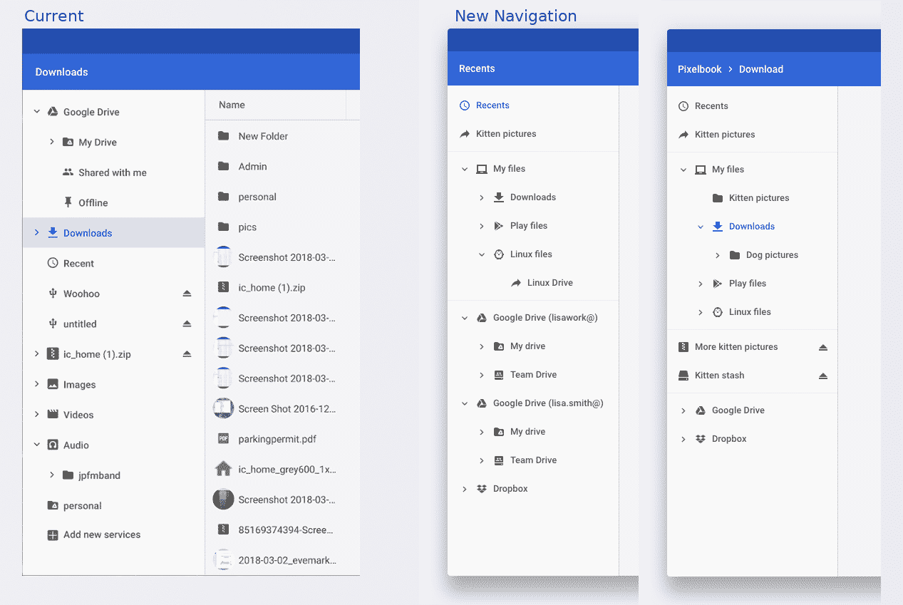

Google recently added both [Android and Linux files to the native Chrome OS Files app](https://www.aboutchromebooks.com/news/chrome-os-files-app-now-shows-android-files-heres-how-to-get-the-feature/) but don't get used to it if you have this feature. Looks like it's changing again. [Chrome Story](https://www.chromestory.com/2018/06/chrome-os-file-manager-getting-restructured/) noticed a [code commit describing the redesign](https://chromium-review.googlesource.com/c/chromium/src/+/1086680) (or is it a re-redesign?) which will move local files higher in the application. Yes, Google Drive is getting moved down from the top spot.

Here's a snippet of what the developers are working on:

> "Add EntryList which implements interface FilesAppEntry to represent a list of entries. This will be used to implement "My Files" which will contain a list of VolumeEntry for the volumes: Downloads, Linux Files (Crostini) and Play Files (ARC++)."

And here's they envision from a design standpoint, with this example showing the current and new look.

Since this design is still in development, it's very possible that it changes before hitting the Stable Channel of Chrome OS. But I'm hoping it doesn't, personally. As I continue to [use Linux apps more and more on my Pixelbook](https://www.aboutchromebooks.com/news/first-look-running-full-linux-apps-on-a-chromebook-with-project-crostini/), I like the idea of those files being treated more like a first-class citizen in the Files app.
