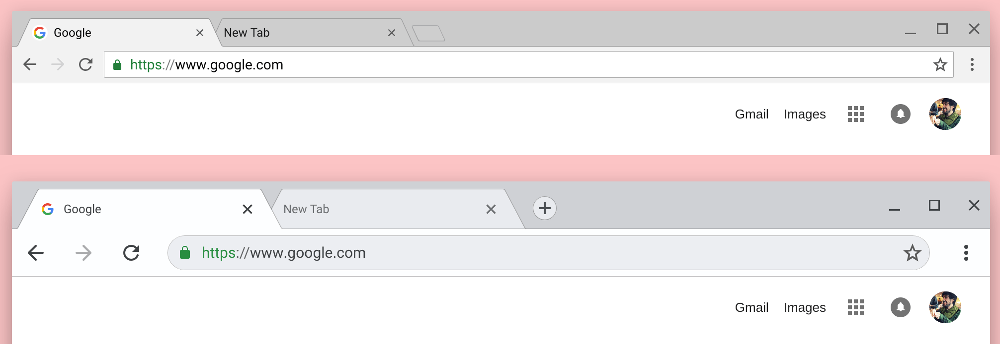

With more [touch-capable Chromebooks](https://aboutchromebooks.com/news/hp-chromebook-x2-arrives-as-the-first-detachable-chromebook-tablet/) and Chrome tablets hitting the market, it makes sense for some updates to make the experience better. That's [exactly what's happening](https://plus.google.com/+FrancoisBeaufort/posts/hziJRCysJME), at least in the Canary Channel of Chrome OS, according to Google's "Happiness Evangelist", François Beaufort.

In a screenshot Beaufort shared on Google+, you can see both the current and new designs. The changes might be subtle to the eye but they're important to your hands: larger tabs, buttons, icons and other touch points, as well as the rounded omnibox.

If the feature makes its way to general availability on the Stable channel, as of now the new look will automatically appear when Chrome OS detects it's running on a touch capable device. It's possible that by adjusting the _chrome://flags/#top-chrome-md_ flag on a non-touch Chromebook or Chrome tablet will enable the look, but we'll have to see.

Using my touch-capable Pixelbook with the default screen settings, I generally get around OK with the current interface. But occasionally, I'll miss a touch target here and there, even on the 12.3-inch display, so these changes will be welcome. With its smaller 9.7-inch screen, I suspect the updated interface will be even more welcome on the [Acer Chromebook Tab 10](https://www.acer.com/ac/en/US/content/series/acerchromebooktab10). Of course, that tablet is expected to be available later this month so I don't think it will launch with the touch-optimized changes still in the works.
