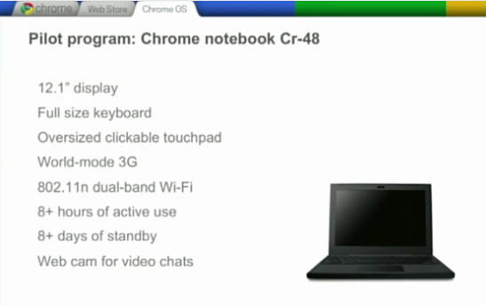
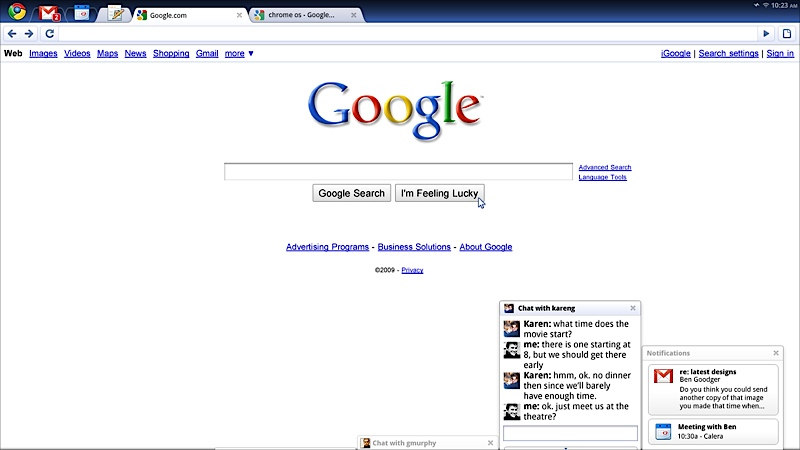
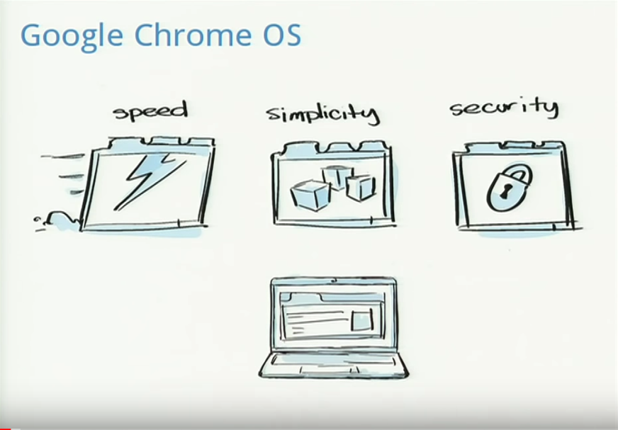

It's hard to believe that Chrome OS has been around for 10 years now, but it's true. [Google announced its intent to create a browser-based operating system in the summer of 2009](https://googleblog.blogspot.com/2009/07/introducing-google-chrome-os.html), just 9 months after launching the Chrome browser, and followed that up with both [a demonstration and a Q&A session with reporters in November of 2009](http://googleblog.blogspot.com/2009/11/releasing-chromium-os-open-source.html).

The first actual Chromebook, the Cr-48 arrived in 2010 but wasn't sold. Instead, Google provided units in a pilot program and the first retail Chromebook, made by Samsung hit store shelves in June 2011.

So it took nearly two years for Chrome OS to go from initial announcement to a commercial product. I remember all of this happening and even had a Cr-48, which was vastly different from the Apple MacBook laptop I was using at the time.

How different was it? Well, the first demonstration _clearly_ illustrates that and I'm embedding it here for when you have time to view it.

https://youtu.be/5JyFbF7QFlY

I felt a bit of nostalgia watching the video earlier this week for several reasons:

- The demo was provided by none other than Sundar Pichai, the current CEO of Google. Back then? Sundar was a VP of Product Management.
- The Chrome OS demonstration ran on another device that I owned about a year prior: An Asus Eee-PC netbook. Fun fact: I covered the 2008 Consumer Electronics Show with none other than that netbook.
- Speaking of netbooks, Pichai noted that Chrome OS would first be targeted at netbook devices, but would later be expanded to traditional laptops and desktops. That happened with a plethora of clamshell Chromebooks, Chromeboxes and Chromebase devices.
- Offline usage was an obvious concern but Pichai noted that web apps using HTML5 standards that included offline data caching would bring offline support. Google itself made great strides in this area as many of its own apps work completely offline now and synchronize data when reconnected to the web.
- Chrome OS devices were intended to be a secondary device. Pichai said Google expects potential buyers to have a primary computer. Yet these days, many people can and do use Chromebooks as a primary device thanks to the addition of Android and Linux apps. Back then, however, Pichai said "...every application is a web application."
- Since the thrust of the presentation was to announce Chrome OS as an open-source project, Pichai said that other browser products could take the publicly available technology and pair it with a different browser. That never happened.

What strikes me most is how bare-bones Chrome OS looked back in 2009, especially compared to now.

Here's a view of the platform then, followed by a recent screenshot of my usage, for example. Note that the Chrome OS logo tab housed shortcuts to your web apps, similar to the Chrome OS Launcher menu of today.

Multiple Chrome tabs, a PWA, Google Play Music Android app and Linux humming along.

These days, we see [far more powerful devices running Chrome OS](https://www.aboutchromebooks.com/news/acer-chromebook-spin-13-with-16-gb-ram-should-you-buy-one/), new form factors, and a tremendously broader set of tools, apps, and capabilities in our Chromebooks. And it's easy to get caught up in those aspects. But it's also worth taking a look at the humble beginnings of Chrome OS to see how much Google delivered on its initial plans and just how far the platform has come.

Oh and one last point to debunk the long-running myth that "Chromebooks are supposed to be cheap." As I've said a number of times before, the three pillars of Chrome OS are the three S's: Speed, Simplicity, and Security.

That's a point made perfectly clear early on in the demonstration from 10 years ago. There's no mention of cost, and indeed, when pressed during the Q&A session, Sundar deferred price questions to its hardware partners.

