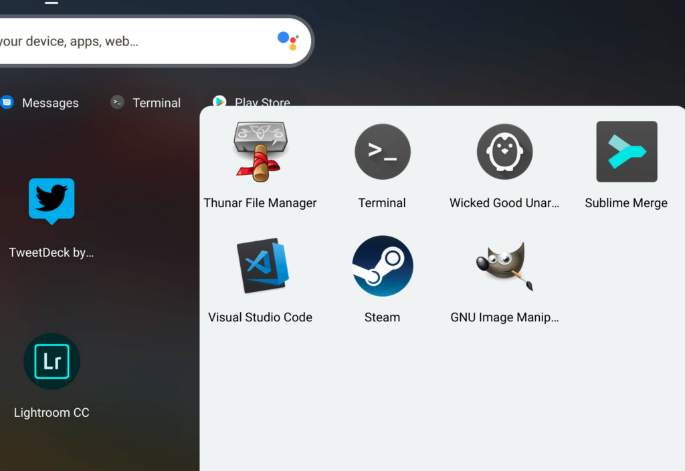

While it has become [easier and more informative when installing Linux packages on a Chromebook](https://www.aboutchromebooks.com/news/linux-package-installs-on-chromebooks-to-show-app-name-version-and-details-possibly-in-chrome-os-73/) over the past several months, another new feature would have made it even easier. Unfortunately, the ability to search for Linux app installation files on the web in the Chrome OS launcher isn't happening for now: The feature has been postponed.

[A bug for this functionality was opened back in January](https://crbug.com/921429), with this description: "Add APT search into Chrome OS App Launcher, so that not installed Linux packages and Apps can be searched for and installed via the App launcher."

Essentially if you want to search for a Linux app that you didn't have installed on your Chromebook, you would be able to do that directly in the Chrome OS launcher.

Clicking on the appropriate result would then download the Linux app package and presumably start the installation process in a best-case scenario. A worst-case option would be to have the package downloaded and then [use the Chrome OS Files app to install it](https://www.aboutchromebooks.com/news/how-to-install-debian-linux-packages-in-project-crostini-chrome-os-files-app/), which is the current process.

In February, coding efforts had made progress for this useful feature:

> CL updates the Crostini Repository Search Results in the app launcher  
> to install Linux packages when clicked. This contains the relevant  
> app launcher and crostini manager changes. This feature is still behind  
> a flag and there are plans to incorporate an installation dialogue  
> into the installation process.

Unfortunately, earlier this month, the bug was updated with the following information:

> Remove Crostini app repository search in the launcher  
>   
> We added behind a flag functionality to search apt repositories from  
> the Chrome OS launcher 4-5 months ago, but we still have no immediate  
> plans to launch this. This CL removes the functionality for now.

There's no specific reason given as to why 4-5 months went by without any progress, nor is there a cause provided for the postponement. Ultimately, it doesn't matter: You won't be using the Chrome OS launcher to search for Linux installations any time soon; at least not until some sort of time-table is provided for the change.

For now, you'll have to find Linux installation packages the old fashioned way by searching the web, downloading them and [manually installing them through the Files app](https://www.aboutchromebooks.com/news/how-to-install-debian-linux-packages-in-project-crostini-chrome-os-files-app/), or adding package repositories to your Linux container and using _apt_ commands, or a package manager, to add Linux apps.

By the way, that feature to [uninstall Linux apps directly from their launcher icons that was expected in Chrome OS 75](https://www.aboutchromebooks.com/news/chrome-os-75-uninstall-linux-apps-launcher-on-crostini-chromebook/) didn't make the cut. This might be related to the postponement but regardless, if you want to remove a Linux app, brush up on that command line functionality. ;)
