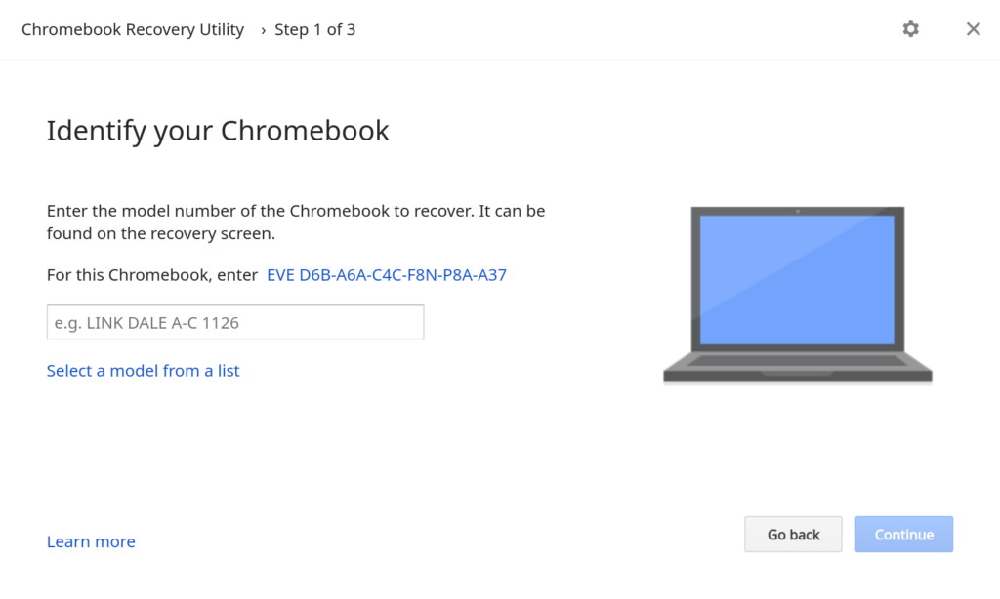
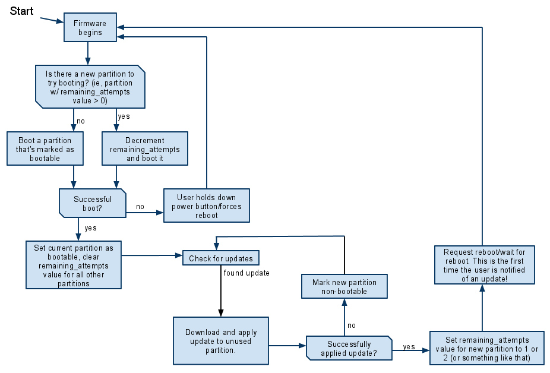

There's an effort underway to [restore a Chromebook's firmware without needing a USB drive](https://chromium-review.googlesource.com/c/chromiumos/platform/vboot_reference/+/2856364), which is required in the current process. Essentially, Chrome OS would have its own native Chromebook recovery software. This means you wouldn't need to use another Chromebook or computer to download the recovery image on a USB stick.

A couple of caveats are worth noting upfront.

First, this is still a work in progress, so I can't say if or when the feature will arrive in Chrome OS. Second, restoring the Chromebook's firmware using this native Chromebook recovery software will require network connectivity. Lastly, I haven't found any evidence that your local data is saved. When recovering a Chromebook, your local data is wiped out currently. I'd love that see that changed, as I'm sure most of you would as well.

As I read the description and the underlying code work, this all seems fairly self-explanatory:

> Add a new boot path within manual recovery mode, activated by the hotkey Ctrl+R. In this boot path, a miniOS recovery kernel is located on internal disk, and an attempt is made to verify and boot this kernel. Recovery proceeds from within the miniOS kernel by downloading a recovery image over the network. No USB disk is used in the process.

If you're not familiar with the current Chromebook firmware recovery process, here's how it works today:

- You boot your Chromebook and see this message: "Chrome OS is missing or damaged"
- You use another computer [to create a Chrome OS recovery image](https://chrome.google.com/webstore/detail/chromebook-recovery-utili/pocpnlppkickgojjlmhdmidojbmbodfm?authuser=0) on a USB flash drive or an SD card.
- Enter recovery mode on the non-booting Chromebook, which is typically done by powering it on while holding the ESC + Refresh button.
- Place the recovery image drive or card into the Chromebook.
- Follow the on-screen instructions to install the recovery image that you downloaded on to your USB drive or SD card

Basically, the Chromium developers are trying to remove the second and fourth items in the above list by adding Chromebook recovery software of sorts.

That may not sound interesting but if you've ever run into the "Chrome OS is missing or damaged" message on your Chromebook, you've scurryied around for some external storage and another computer. And sometimes, you may not have access to one or both of those. I've run into this situation on more than one occasion, which taught me to [always carry a USB stick with me](https://www.aboutchromebooks.com/news/why-every-chromebook-owner-should-carry-a-usb-key-or-sd-card-with-them/).

Even if you're never had to do a recovery, built-in Chromebook recovery software will be welcome for that one time you do have an unbootable device.

In terms of the implementation, it's actually quite ingenious.

Every Chromebook has two partitions, let's call the "copies" or "versions" of your Chrome OS software. Let's call them A and B, for simplicity. When you're running Chrome OS on version A, then version B is the previous version of Chrome OS. When you have a Chrome OS software update available, version B becomes the more recent copy and then A is the previous version.

This is why the software platform can be updated in the background without impacting your work session. And when you restart your Chromebook after a software update, it boots into the newly updated partition; version B if we continue the example.

Based on my understanding of the code changes, if this feature arrives, your Chromebook would boot directly into recovery mode using the kernel from the _backup_ partition, where it would still have access to network capabilities.

That means you could then simply download the latest firmware directly to the impacted Chromebook instead of finding removable storage and another computer. Easy peasy!
