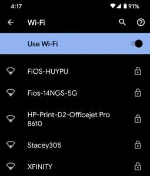

Slowly but surely, Google has been improving the ["Better Together" strategy](https://www.aboutchromebooks.com/news/better-together-bringing-instant-tethering-voice-calls-and-easy-unlock-to-chromebooks/) that integrates the user experience between Chromebooks and Android phones. The latest feature in the works is for [Chrome OS to sync your Wi-Fi network settings and credentials between the two devices](https://chromium-review.googlesource.com/c/chromium/src/+/2364079), according to [code commits found by 9to5 Google this week](https://9to5google.com/2020/08/19/chrome-os-sync-wifi-passwords-android-phone/).

Like most new features for Chrome OS, this one will be hidden behind an experimental flag; at least at first. I'm currently running the Chrome OS 86 Dev Channel on one of my Chromebooks and don't see yet. When it appears, _possibly_ in 86 but I'm thinking more likely in 87 since work just began on the feature, you should find the flag at `chrome://flags/#wifi-sync-android`

According to developer comments, this is a two-way sync, meaning it will be beneficial whether you get either a new Chromebook or a new Android phone.

When signing in and setting up the new device, your Wi-Fi network configurations and passwords should sync from the old device, saving time to get connected.

Well, at least it will save time if its a new Chromebook that you add: I'd think you'd first have to get that Chromebook on a network before it can sync from Google's cloud and get your Wi-Fi network information. At least phones have LTE for that first connection to get wireless network information.

Regardless of that potential limitation, I'm all for anything that makes Chromebooks and Android phones work better together (yeah, I went there). I moved over from my iPhone 11 Pro to an older Pixel 4 with the Android 11 beta earlier this month and I'm super happy with how it's worked out so far.
