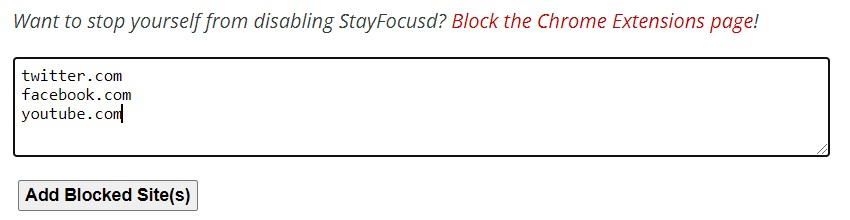
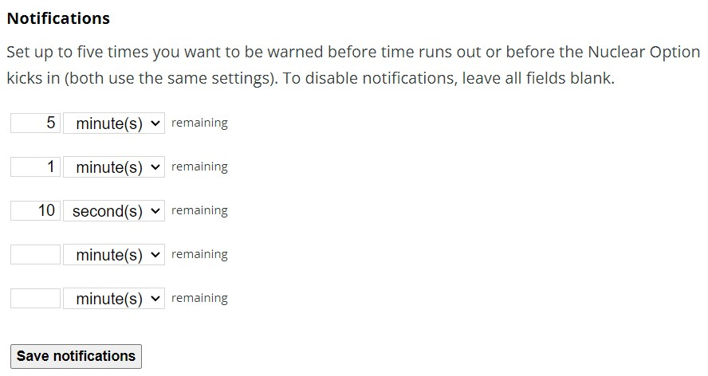

One of the [very things I love about using a Chromebook](https://www.aboutchromebooks.com/news/how-to-view-apps-or-browser-tabs-side-by-side-on-a-chromebook-snap-assist/) is also one of the things I hate. Since Chrome OS is browser-centric, it's **_far_** too easy to open a tab to some time and waste time when I should be working. After thinking about how to keep focused and get more done, I came up with a [Chrome OS productivity](https://www.aboutchromebooks.com/tag/productivity/) tip that's working well. I researched and then installed a Chromebook site blocker extension to Chrome OS.

There are a number of these out there. For now, [I'm using StayFocusd,](https://chrome.google.com/webstore/detail/stayfocusd/laankejkbhbdhmipfmgcngdelahlfoji/related) mainly because it has the features that I was looking for. I wanted an option that lets me block sites during configurable hours and days, for example. That lets me create chunks of work time without online distractions. I also wanted a solution that would allow me to have a little breathing room for downtime. StayFocusd allows for me to set a number of minutes where I can use a blocked site.

I also looked at some other services that expand beyond Chrome OS in case you want this type of service extended to applications on a PC. [Freedom](https://freedom.to/) and [FocusMe](https://focusme.com/) looked interesting for those that need a little productivity nudge in that case, although they have a subscription fee. The StayFocusd extension is free to use. And it can sync your settings across multiple Chromebooks or devices where you use the Chrome browser.

Set up is relatively easy for this Chromebook site blocker extension.

You can configure sites manually or add them to the StayFocusd list by clicking the extension on any open tab. And if you're curious about how much time you have left on a site you blocked, but added some "me time" to, the extension will show that as well. I noticed that having a blocked site open in this case only affects your time limit when you're looking at the site.

I like checking Twitter every so often, for example, so I did allow for 15 minutes of usage during my work hours. That lets me jump into the Twitterverse, check notifications and/or respond, and then jump back out. Without a limit, I tend to doomscroll without noticing how much time I'm blowing.

You can also configure notifications for any time limits set on a site.

For the really hard-core productivity folks out there, you can even lockdown StayFocusd. There's a nuclear option that blocks all sites until a time you specify, although I wouldn't see that too useful on a Chromebook. And you can set up a challenge question to be asked before making any configuration changes. That will prompt you with your challenge but also offer an inspirational quote to make you think twice.

From a security perspective, no browsing data is being sent from a Chromebook with StayFocusd, save for one exception that makes sense:

> "StayFocusd does not collect _any_ personal information, nor does it track any information about which sites you have visited or for how long. It also does not transmit any of your data off your own computer. The lone exception is that it uses Google Sync to sync your Blocked Sites and Allowed Sites to your other computers. You can disable that feature from the Customize tab in the StayFocusd settings page."

Note that if you want, you can enable this extension for Incognito Mode as well. No sneaking over there when there's work to be done!

So far, this extension has helped me get more done on my Chromebook. And I only have it configured for workdays: On the weekends, I have free reign on the web.

Of course, if I'm [behind on my Computer Science homework](https://www.aboutchromebooks.com/news/linux-on-chromebooks-just-might-get-me-through-a-masters-in-computer-science/) and need extra time to complete it on a weekend, my Chromebook site blocker extension is just a click away for some extra productivity time.

Are you using a similar solution or another Chromebook site blocker extension? I'm sure there are many other options out there to boost productivity that I haven't heard of yet.
