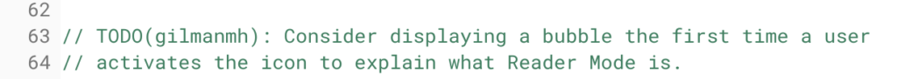

Now that [Chrome OS 75 is slowly rolling out again](https://www.aboutchromebooks.com/news/chrome-os-75-stable-channel-version-rollout-resumes-on-a-limited-basis/), Chromebook owners will be able to use the [built-in "reader mode" for distraction-free browsing](https://www.aboutchromebooks.com/news/chrome-os-75-reader-mode-how-to/) it includes. Unfortunately, the experience of switching a web page from its traditional view to reader mode is a bit esoteric. However, a change is in the works to make it easier with a dedicated icon switch.

Currently, to use reader mode you have to enable this flag: _chrome://flags/#enable-reader-mode_. Then you click the three-dot Chrome menu and choose the "Distill Page" option.

A [new Chromium code commit indicates that reader mode will get its own toggle switch icon in the omnibox](https://chromium-review.googlesource.com/c/chromium/src/+/1658833).

Here's a description of the upcoming change:

> Display Reader Mode icon in omnibox.  
>   
> This adds an icon that toggles Reader Mode on and off for the current  
> web contents. It is only visible when the enable-dom-distiller switch  
> is set to true, either via command line or via chrome://flags.

Frankly, this is how this feature should have rolled out in the first place from a usability standpoint. However, as is often the case with Chrome OS, functionality - often hidden and not explained well - comes first and refinement then follows. The new icon may also have an explainer for users upon first appearing:

As for when this icon switch will follow, I can't say yet.

There's no release date [tagged to the bug for this functionality](https://bugs.chromium.org/p/chromium/issues/detail?id=952042), which is still listed as a "work in progress". Additionally, this new reader mode icon won't be just for Chromebooks; it will arrive on the Chrome browser for all supported platforms.
