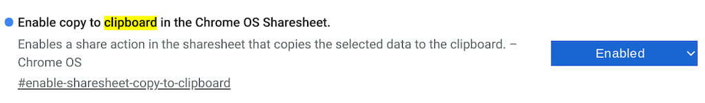
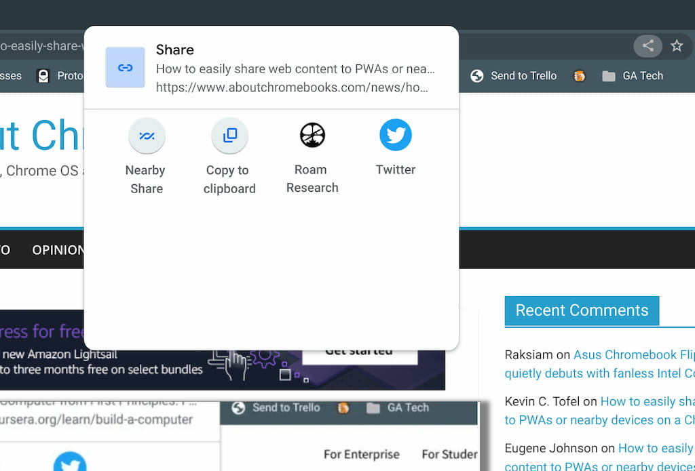

I previously wrote about the [upcoming Chrome OS Sharing Hub](https://www.aboutchromebooks.com/news/how-to-easily-share-web-content-to-pwas-or-nearby-devices-on-a-chromebook/), which is an experimental feature. When I tested it, I was able to tap the sharing icon and shoot a web link to my installed Progressive Web Applications. I noticed another experimental flag that tells me the Chrome OS Sharing Hub is shaping up to be a unified feature with multiple sharing features. In addition to Nearby Share and PWA support, the new flag adds a nice copy to clipboard Chromebook feature.

I'm using it on the Chrome OS 97 Dev Channel, so it may not yet appear in the Beta Channel; that's currently version 96. And the Stable Channel has only been version 94 for the last few weeks, so it's not there yet either. Remember that [Chrome OS is skipping version 95](https://www.aboutchromebooks.com/news/opinion-its-time-to-reconfigure-chrome-os-version-numbers/) to get in sync with the four-week Chrome browser release cycle.

To enable this new copy to clipboard Chromebook feature in the Chrome OS Sharing Hub, you'll obviously need to have the Sharing Hub enabled first. [Here's how to do that](https://www.aboutchromebooks.com/news/how-to-easily-share-web-content-to-pwas-or-nearby-devices-on-a-chromebook/).

Then, go to `chrome://flags#enable-sharesheet-copy-to-clipboard` and choose "Enabled" from the drop-down menu.

You'll be prompted to restart your browser, which only takes a few seconds. Upon restarting, you can tap the Sharing icon on the right side of the Omnibox and you'll see the additional function. Click it and you'll have the web page link copied to your Chromebook's clipboard.

Obviously, this isn't the only way to copy a web link to the clipboard on a Chromebook.

You can certainly highlight the link and use the `CTRL + C` hardware keyboard shortcut to do this. Or you could right-click any web page and choose the contextual menu option to save any link from a web page.

This is still an experimental feature, so it may change before implementation, likely in Chrome OS 97. In the meantime, I'm appreciating the ability to quickly tap two icons to use the Chrome OS Sharing hub to capture or share page links
