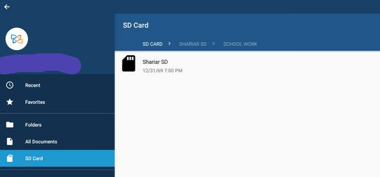

[Google announced an update to the Chrome OS Beta Channel](https://chromereleases.googleblog.com/2018/05/beta-channel-update-for-chrome-os_10.html) on Thursday and along with the regular slew of fixes, there's a welcome new feature too: Android apps on Chromebooks can see and save data to an SD memory card. Here you can see the XoDo Android app on a Samsung Chromebook Pro accessing the SD card:

\[caption id="attachment\_498" align="aligncenter" width="650"\] Credit: Reddit user marcellusmartel\[/caption\]

Although Google doesn't mention this in the release notes, [a Redditor spotted the change](https://www.reddit.com/r/chromeos/comments/8ihsbg/670339641_beta_android_apps_can_now_access_sd_card/), which [was reported by Android Central](https://www.androidcentral.com/chrome-os-now-allows-android-apps-use-sd-cards). I can't test it since my Pixelbook doesn't have a memory card slot, but if your Chromebook or Chromebox does have storage expansion, you'll need Beta Channel version 67.0.3396.41 installed ([Here's how to change channels](https://www.aboutchromebooks.com/qa/whats-the-difference-between-developer-mode-and-the-dev-channel-on-a-chromebook/)). The feature may still be a work in progress too: Some folks say they're having more success reading files than in writing them.

Keep in mind that it doesn't appear you can install Android apps to external memory cards with this function. Those are still  installed on the integrated flash memory of your Chrome OS device. Might that change in the future? I'm leery because Google is running Android in a sandboxed container within Chrome OS for security reasons: Having Android apps actually installed outside that container might not be in the cards, but we'll see.

Regardless, this is welcome news because you won't have to use precious local storage for Android app files and data once any issues get ironed out and this moves to the Stable Channel.
