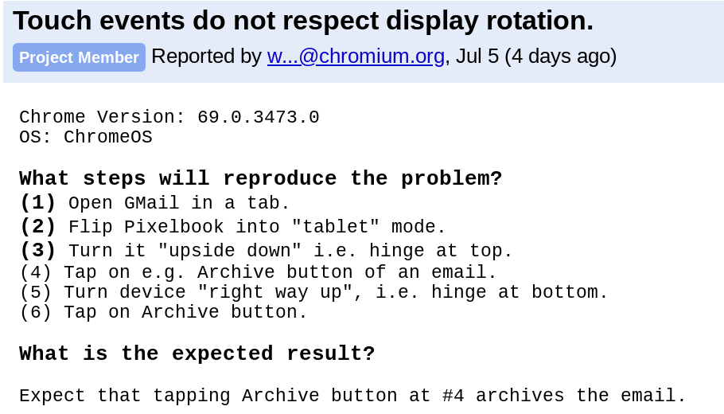

I've read a few instances where a [Chrome OS tablet](https://www.aboutchromebooks.com/tag/chrome-tablets/) wasn't properly responding to touch events in portions of the screen and now I've seen it for myself on different devices. In one case, I was browsing the web in portrait mode: Tapping a link on the right side of the display was activating an input box on the left side!

Luckily, this seems to be happening only on the Chrome OS Dev Channel, although if you're seeing it in Beta or Stable, let me know.

It seems that display rotation is at least related to the problem, if not the root cause. I guess you could say the issue is because "you're holding it wrong." ;) The good news is that there's an [open bug report for the problem](https://bugs.chromium.org/p/chromium/issues/detail?id=860356) that was created a few days ago.

Yesterday, I added more information to it because the listed steps to reproduce the issue focused on the Google Pixelbook. Once I experienced it on an [HP Chromebook X2](https://www.aboutchromebooks.com/tag/hp-chromebook-x2/), I decided to point that out in the bug because I don't want the support team approaching this like it's a hardware issue specific to the Pixelbook. It's happening on the X2 and on the [Acer Chromebook Tab 10](https://www.aboutchromebooks.com/tag/acer-chromebook-tab-10/) too.

As of the time of this writing, the bug has not been assigned to a developer. So there's no timetable on when this might be resolved.

If you're experiencing the touch problem, I'd recommend letting Google know by starring the bug; you can do that at the top left of the bug report. That will indicate how many people are affected and will also provide you updates on progress for the solution.

And keep in mind that the Dev Channel often has bugs or other issues. That's expected. However, if we, as Chrome OS users, don't report them, those bugs could filter to a wider audience as code makes its way through the Beta and Stable Channels. So, file those bugs!
