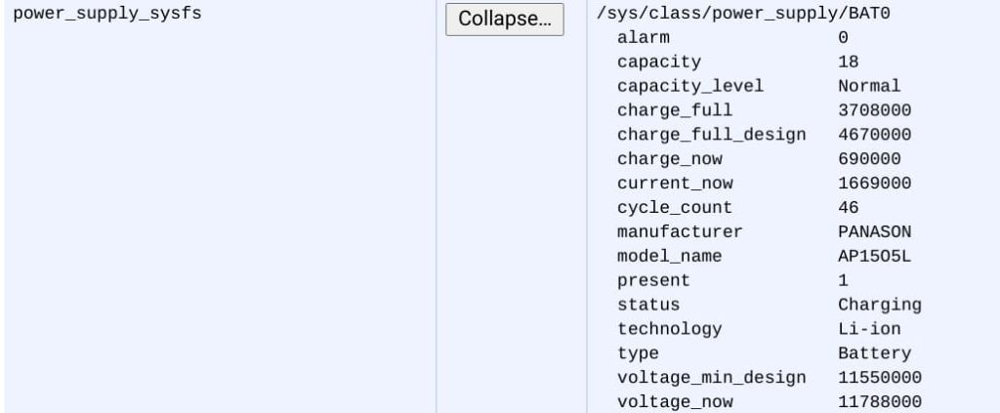

One of the most read posts here on the site is explaining [how to check the battery life of your Chromebook](https://www.aboutchromebooks.com/how-to/how-to-check-the-battery-health-of-a-chromebook/). While the method described there works, it's pretty limited and certainly not user friendly. Luckily, the Chromium team is looking to use the [Smart Battery metrics standard in a future release of Chrome OS](https://crbug.com/1047277), providing more data about the battery inside your Chromebook.

This feature request actually started up back in January as a way to "expose Smart Battery metrics to CrOS daemons like debugd and cros\_healthd", so Chrome OS would be able to access a wider range of battery data.

Currently, if you browse to `chrome://system` and scroll down to the `power_supply_sysfs` section, you'll see something like this:

That's helpful and useful information. However, did you know that there's been a [Smart Battery Spec since 1998 (PDF)](http://sbs-forum.org/specs/sbdat110.pdf) that Chrome OS doesn't use? Neither did I, but if you did, bonus nerd points to you!

So what would exposing the Smart Battery data provide? Details such as the serial number and manufacturing date of the battery, which would be useful for a hardware partner to better support Chromebook battery issues. Additionally, users could also see metrics such as the battery temperature and more accurate times for charging or remaining usage.

Initially, this internal feature request was specifically for the manufacturing date of a battery. However, since then, the list has expanded to include just about everything in the Smart Battery spec.

> This change (along with a corresponding firmware change) allows the smart battery's I2C bus to be exposed through a CrOS EC tunnel, and then the sbs-battery driver can bind to that and expose the smart battery properties in sysfs.

And although not every older Chromebook will gain the battery data access, the team is working to backport a solution to many devices: From the current code, it appears that older Chromebooks running on the Linux 4.19 kernel will gain the feature.

It could well be that this battery data will mainly used by hardware partners. However, once all of the Smart Battery data is exposed to Chrome OS, I wouldn't be surprised to see some way for users to easily access all of it, whether it's in a friendly user interface or even if only by searching in `chrome://system` to see it.
