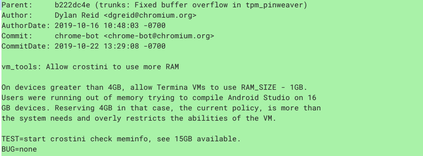

Here's an interesting Chrome OS change coming up considering that I now [use a Chromebook with 16 GB of RAM](https://www.aboutchromebooks.com/news/acer-chromebook-spin-13-with-16-gb-ram-should-you-buy-one/): A new code commit will change how memory is allocated to the Linux environment on Chromebooks with more than 4 GB of RAM. Those devices will see more memory provided to the Linux container.... a lot more, as it stands now.

The [code commit description](https://chromium-review.googlesource.com/c/chromiumos/platform2/+/1868069) says it all and I was surprised to see that if you have more than 4 GB of memory in your Chromebook, all but 1 GB of it will go towards Linux.

I understand the specific reason noted above that would require this memory allocation change. But it seems a bit excessive when it comes to running Linux on a Chromebook with more than 4 GB of memory. Or rather, it seems like leaving just a single GB of RAM to run Chrome OS on such a device feels too limiting.

What I'd prefer to see (if anyone on the Chromium team cares about my opinion!) is a memory allocation slider in the Linux settings within Chrome OS. This way, I could choose to allocate, for example, 4 GB of memory to Chrome OS and 12 GB to the Linux container on my [Acer Chromebook Spin 13](https://store.acer.com/en-us/chromebook-spin-13-cp713-1wn-37v8) with 16 GB of memory, prior to starting up a new Linux container.

I suppose if you're [coding in Linux](https://www.aboutchromebooks.com/news/how-to-code-on-a-chromebook-crostini-pixel-slate/), you could just open up the [Chromium browser](https://www.chromium.org/getting-involved/download-chromium), rather than use Chrome OS to read and search for development documentation.

Even so, the idea for Project Crostini as I understand it is to provide access to Linux apps within the Chrome OS platform, as in using both software platforms simultaneously. Leaving Chrome OS with a single GB of RAM, in this case, feels like it could be a bit detrimental when it comes to performance.

There's no associated bug to file feedback on this feature change, so until there is one, there's no way to let the Chromium team how you may feel about this. But I'm sure you'll sound off in the comments here!

As far as timing, without an associated bug, it's difficult to say when this change will go live on the Stable Channel. Given that the feature freeze for Chrome OS 79 passed on October 4, my educated guess is that this will be a Chrome OS 80 deliverable. However, I'll check and confirm when the next version or two of the Stable Channel arrives.
