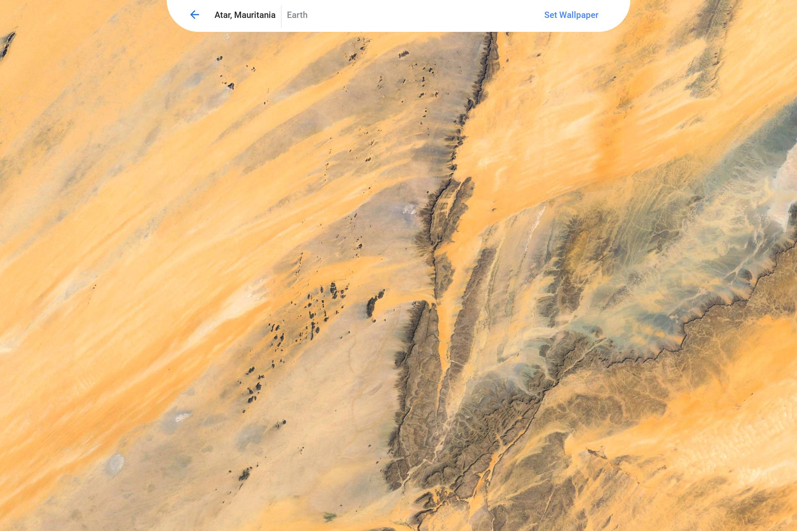

After months of redesigns, Google has moved [a new Chrome OS wallpaper picker](https://chromium-review.googlesource.com/c/chromium/src/+/1099999) to the Dev Channel, which just got an update on Friday. My Pixelbook is now on the [new Dev Channel v. 68.0.3440.25](https://chromereleases.googleblog.com/2018/06/dev-channel-update-for-chrome-os_15.html) and the "final" version of this feature looks quite different and much improved.

Above is what it looks after I enabled the _#enable-new-wallpaper-picker_ flag, which you can do by typing _chrome://flags_. The overall size of the controls and thumbnails are larger, making it easier to adjust wallpaper settings while in tablet mode on a Chromebook or Chrome OS tablet.

When choosing a new wallpaper, you get a nice [full screen preview with easy to touch controls at the top of your display](https://chromium-review.googlesource.com/c/chromium/src/+/1089998) as well:

The most recent code commit shows that Google is [readying this feature to be enabled by default](https://chromium-review.googlesource.com/c/chromium/src/+/1099999), meaning once that happens, you can still modify the flag, but it will be on by default; I had to manually enable it but that should change in the coming weeks.

Lastly, the old "surprise me!" feature that showed random images to choose from wasn't so random. Google actually used to pick them. Now they'll work similar to how a Chromecast-connected display works: [Using the Backdrop server](https://chromium-review.googlesource.com/c/chromium/src/+/1093742) to rotate through [various new images automatically](https://www.google.com/chromecast/backdrop/).
