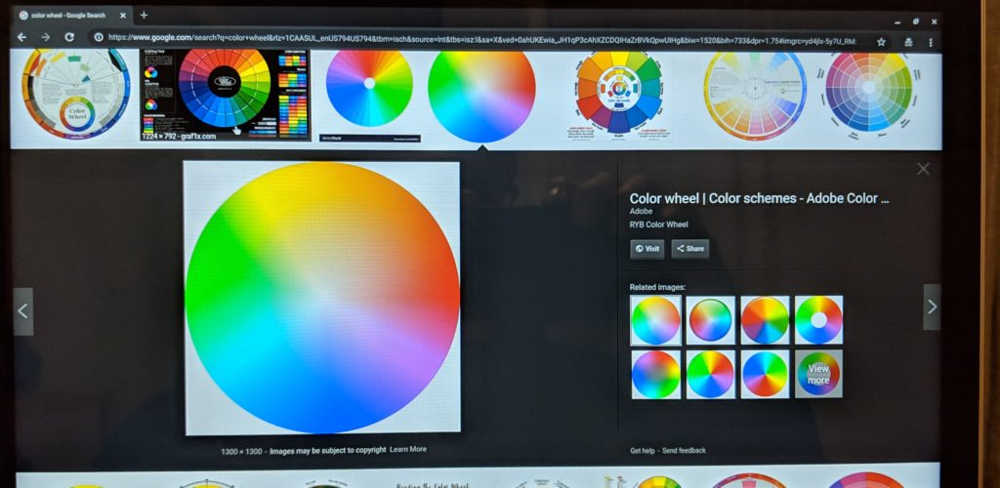
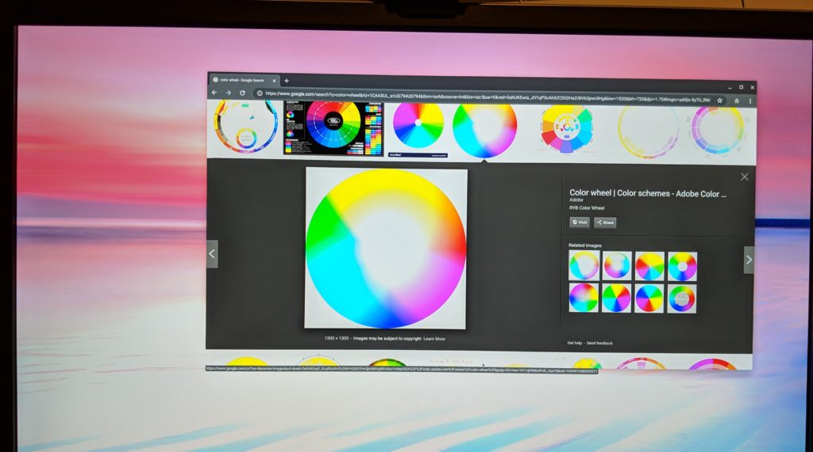
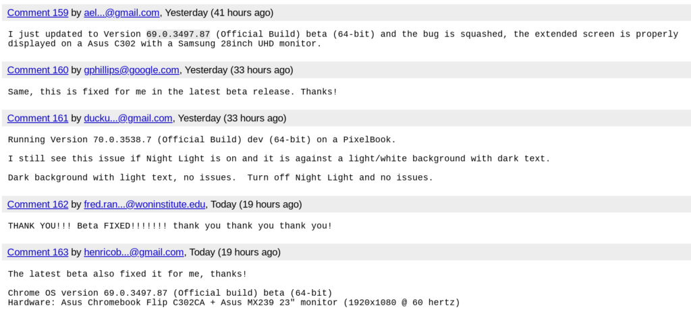

Back in June, some [Chromebook users reported that the output on external displays was "washed out"](https://bugs.chromium.org/p/chromium/issues/detail?id=848540). Colors and images were fine on the Chromebook's internal screen but when viewing the same thing on an external monitor over HDMI, things didn't look quite the same.

Here's a comparison to illustrate the problem:

\[caption id="attachment\_1651" align="aligncenter" width="800"\] Colors can be seen on the Chromebook display\[/caption\]

\[caption id="attachment\_1650" align="aligncenter" width="800"\] The external display showing the same image is washed out\[/caption\]

After three months of troubleshooting and various attempts to fix the issue, it appears that Chrome OS 69.0.3497.87 Beta Channel fixes the problem. Several happy Chromebook users report that this bug is squashed on their devices, however, one person says the issue remains when using Chrome OS' Night Light feature; this changes the internal display to an amber color to reduce blue light.

Even with that nit still remaining, if you use an external monitor with your Chromebook or a Chromebox, you might want to give the Beta Channel a try if you can't wait for the fix to hit Stable. _Disclaimer_: Moving from the Stable to the Beta Channel won't delete your local Chrome OS data but you may encounter other bugs that are not in the Stable Channel.
