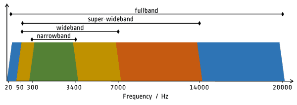

It's 2019 and you probably can't remember how bad traditional phone calls used to sound. That's because these days, most handsets support wideband audio, also referred to as HD Voice. Surprisingly, wireless voice calls over the web on a Chromebook don't actually support wideband audio, but that's going to change based on some code updates I spotted.

[A bug for this feature was actually opened 13 months ago](https://bugs.chromium.org/p/chromium/issues/detail?id=843048). However, it's only recently that the work on adding support for wideband audio over Bluetooth has taken place. [The first part of the effort is now merged into Chrome OS 76](https://chromium-review.googlesource.com/c/chromiumos/third_party/adhd/+/1362734/12).

Don't get too excited to try out clearer voice calls just yet though, even if you have the Chrome OS 76 Dev or Beta Channel installed. There are still some supporting changes required before those Bluetooth headphones sound better on Chrome OS voice calls:

> We're adding HFP wideband speech mode support, but will not  
> enable it until PLC(packet loss concealment) is well implemented.  
> To allow this feature be tested, add a flag in system state  
> and use cras\_test\_cilent to toggle it.

There's no mention of quickly the PLC implementation will take and since [Chrome OS 75 just hit the Stable Channel](https://www.aboutchromebooks.com/news/chrome-os-75-stable-version-released-what-you-need-to-know/), wideband speech mode over Bluetooth might not be ready for Chrome OS 76.

Just to further explain the audio side of this change, the audio frequency of [regular old voice calls fit into the narrowband range of this chart](https://bloggeek.me/single-voice-codec-webrtc/):

Adding the mSBC codec to the HFP, or hands-free profile of Bluetooth on Chrome OS expands the range, nearly doubling it, with the wideband section above.

The best audio representation I could find is from [PCMag, which created audio files from a number of different voice calls and codecs](https://www.pcmag.com/article/360357/how-to-make-your-cell-phone-calls-sound-better), ranging from 2G voice all the way up to calls using the Extended Voice Services codec over LTE. This isn't an _exact_ representation of what to expect from this code change as a result but gives you an idea.

The audio quality difference is more apparent with headphones but you should still be able to discern some quality between the two on regular computer speakers.

https://soundcloud.com/pcmag-1/t-mobile-to-t-mobile-2g-to-lte?in=pcmag-1/sets/t-mobile-to-t-mobile-calling-tests

https://soundcloud.com/pcmag-1/t-mobile-to-t-mobile-volte-evs?in=pcmag-1/sets/t-mobile-to-t-mobile-calling-tests

I tend to use USB-C headphones for my audio (and video) calls on the Pixel Slate. That's mainly out of convenience.

But I do have some high-end noise-cancelling Sony Bluetooth headphones which are great for music. They can also work with Bluetooth calls, so once Chrome OS gains wideband audio, HD Voice, or whatever you want to call it, I'll be wire-free from that point on.
