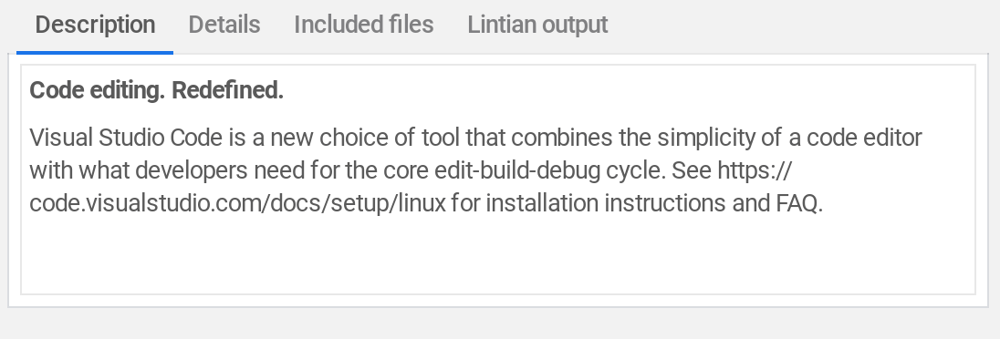
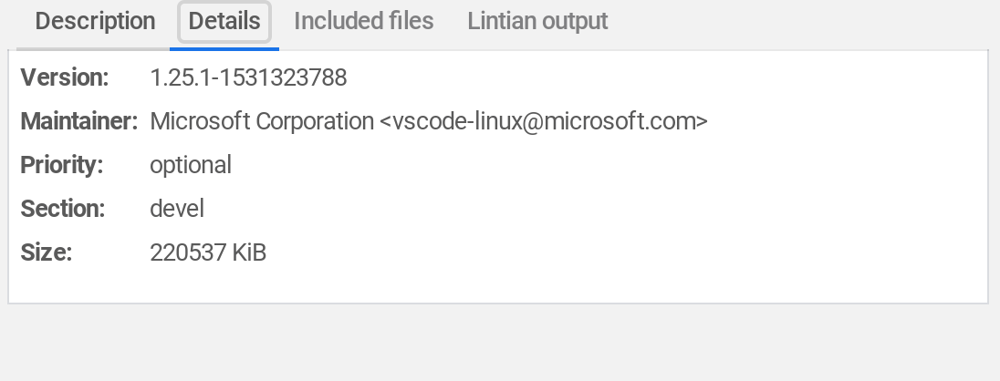

Last month, Google made it [easy to install Linux apps](https://www.aboutchromebooks.com/news/how-to-install-debian-linux-packages-in-project-crostini-chrome-os-files-app/) using [Project Crostini](https://www.aboutchromebooks.com/tag/project-crostini) on supported Chromebooks: After downloading a .deb package, there's a simple two-click install process in the Files app, shown above. Of course, you can always use the command line interface or your package manager of choice to do this. And many folks probably will use those options because the .deb install function in Chrome is fairly bare-bones.

That's changing soon because [Chrome OS will display key package information as part of the install process](https://chromium-review.googlesource.com/c/chromium/src/+/1167005). Here's a description of the change:

> Display .deb package info in install dialog
> 
> This CL adds a details pane in the file manager's .deb install dialog to provide package name, version, and a description of the package.

If you're not sure what that means, here's some example information from a package manager about MS Visual Studio Code, which is installed on my Pixelbook.

Here you can see the description data, version, and other package info. Just to be clear, the above image _isn't_ how Chrome OS will display the package details. Instead, it will appear as a dialog box when installing a .deb package in the Chrome OS Files app, likely included in this one:

Users would then have more information about the package before deciding to click the Install button.

I still have an open question about how dependencies -- essentially other packages and binaries that are pre-requisites for what you want to install -- are handled by the Chrome OS package installation process. I haven't run into any issues yet but I don't want to assume "it just works." And ideally, I'd like to see some dialog boxes showing dependency information as well. However, the addition of basic package info is a step in the right direction.
