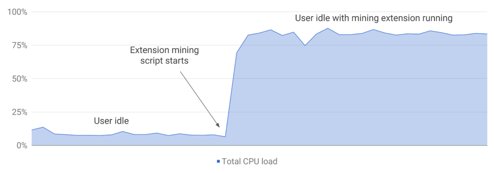

Chrome extensions that mine cryptocoins in the background will soon be a thing of the past. Today the Chromium Blog announced that [Google will no longer accept new Chrome Web Store extensions that perform this mining](https://blog.chromium.org/2018/04/protecting-users-from-extension-cryptojacking.html). And by the end of June, any existing extensions like these will be de-listed from the Chrome Web Store.

A look at this chart from the Chromium Blog explains why this has been an issue: Mining can significantly spike the CPU usage, which leads to performance degradation. And since speed is one of the the "three S's" for Chrome OS -- the others being secure and simplicity -- these extensions are the antithesis of the platform.

Of course, the other obvious reason for this action is that this type of mining doesn't benefit the user. Instead, whoever writes an extension like this, even if it provides some other useful end-user functionality, gains any financial benefit from the mining activities. Who wants to suffer performance degradation and not be compensated for it? Not me.

Google is basically calling these extensions malicious software. And they're right to do so.

If I was a Chrome Admin at a school or office and people kept complaining that their systems were suddenly much slower, I'd be livid at the possibility for such malicious activity causing grief. For those that are Chrome device or browser administrators, you might want to check the [Chrome policy for only allowing approved apps and extensions](https://support.google.com/chrome/a/answer/2657289); not just for this particular situation but to ensure that one-off extensions aren't causing other issues.
