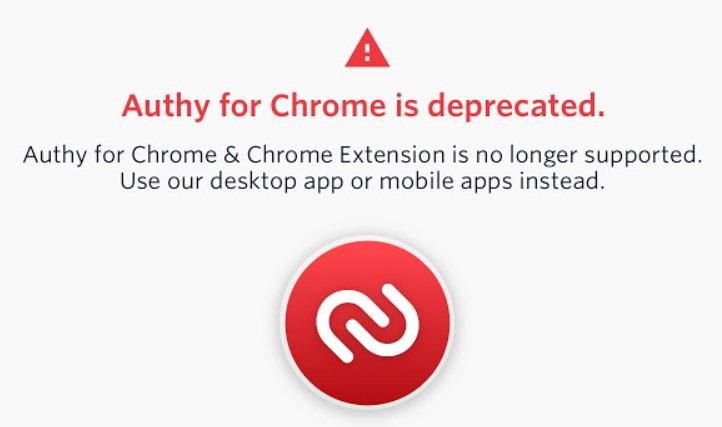

Back in January, Google announced that [support for Chrome Web Apps would effectively cease in June of 2021 for Chromebooks](https://blog.chromium.org/2020/01/moving-forward-from-chrome-apps.html). Today, these web apps got an extra lease on life: [Google will support them until June of 2022](https://blog.chromium.org/2020/08/changes-to-chrome-app-support-timeline.html).

This might not sound like a big deal, but I think it is. We're not yet at the point where Progressive Web Apps are ubiquitous, for example. And while I don't personally use a ton of Chrome Web Apps, there's one that's key for me: Authy, which is a fantastic two-factor authentication app.

Unfortunately, this extra year of support doesn't help me with Authy. When Google made its January announcement to deprecate Chrome Web Apps, [the Authy team pulled the plug on its web app](https://support.authy.com/hc/en-us/articles/360042973993-Authy-for-Chrome-App-Extension-End-of-Life).

To make matters worse for when using a Chromebook, here's the recommendation from the Authy team, emphasis mine:

> We strongly recommend that you immediately switch to using our [desktop and mobile apps](https://authy.com/download/) instead. These top-rated apps offer similar or better features for securely storing your authenticator account tokens, and are fully supported and regularly updated. Simply **download one or more of these apps** and follow the steps to transfer your existing account tokens.

Yeah, I can't download one or more of these apps. Well, maybe the Android version I suppose but that's really a workaround. It will have to do.

Anyway, that's just me. I'm a bit salty about losing the Authy web app. And Chrome Extensions aren't going away, which is good. Anyone else using a Chrome Web App or apps that is in a similar bind to me?
