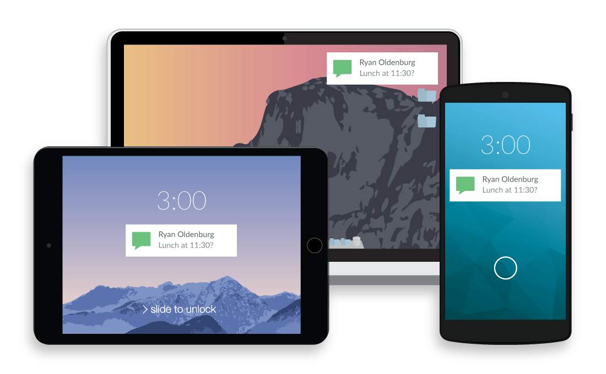

Hot on the heels of news indicating that [Chromebooks will eventually support Project Fi and eSIM capability](https://www.aboutchromebooks.com/news/meet-project-hermes-esims-and-likely-project-fi-on-chromebooks/), Google is looking to bring [Android Messages support to Chrome OS](https://chromium-review.googlesource.com/c/chromium/src/+/1092192/1/chrome/browser/about_flags.cc) devices. [XDA-Developers caught the work in progress](https://www.xda-developers.com/chrome-os-android-messages-integration/) showing work on a new experimental flag setting called _enable\_android\_messages\_integration_.

It's a bit odd to see this since [Google has revamped Android Messages to work with RCS, or Rich Communications Services](https://www.blog.google/topics/rcs/partnering-mobile-industry-connect-people-and-businesses-rcs/), including support for web-based messaging.

Be that as it may, there's a setting in the latest [Android P developer preview](https://developer.android.com/preview/) to show how messages can be linked from an Android phone to a Chromebook. For now, the feature is called "Better Together" and the setup screen looks like this:

I suspect this will work a little more natively than using the Android version of Messages if there's a full integration here with Chrome OS but that's just a guess based on the limited information we have. So hopefully, even if you don't have Android Messages installed on a Chromebook that supports the Google Play Store, you'd still have access to texts in Chrome OS.

This news is related to the recent development of code suggesting that we'll see more always connected Chromebooks in the future thanks to eSIM technology. _Perhaps_ the eSIM will be a "clone" of sorts for the SIM in your Android phone so you have a single phone number on both your Chromebook and handset. More likely, however, this would work with text forwarding that uses two separate numbers -- similar to how my Apple Watch 3 with LTE and iPhone work, for example -- in a seamless experience.

Note that for years there have been third-party solutions that bring texts from an Android phone to computers. When carrying my Pixel XL as a primary phone, I use [Pushbullet](https://www.pushbullet.com/) (shown below) to accomplish this. So this isn't necessarily new, however a native experience typically is a better one.

